# 娱乐头条\_spider\_实战


## 1. 爬取163娱乐新闻数据

### 1.1 准备工作 :

* 1) 创建项目 :  gossip-spider-news  (maven jar工程)

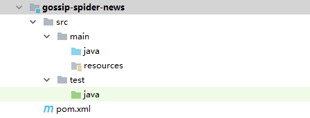

* 2) 添加pom依赖:

```xml
<dependencies>
        <dependency>
            <groupId>org.apache.httpcomponents</groupId>
            <artifactId>httpclient</artifactId>
            <version>4.5.4</version>
        </dependency>
        <dependency>
            <groupId>org.jsoup</groupId>
            <artifactId>jsoup</artifactId>
            <version>1.10.3</version>
        </dependency>
        <dependency>
            <groupId>mysql</groupId>
            <artifactId>mysql-connector-java</artifactId>
            <version>5.1.38</version>
        </dependency>

        <dependency>
            <groupId>org.springframework</groupId>
            <artifactId>spring-jdbc</artifactId>
            <version>4.2.4.RELEASE</version>
        </dependency>

        <dependency>
            <groupId>c3p0</groupId>
            <artifactId>c3p0</artifactId>
            <version>0.9.1.2</version>
        </dependency>

        <dependency>
            <groupId>com.google.code.gson</groupId>
            <artifactId>gson</artifactId>
            <version>2.8.1</version>
        </dependency>

        <dependency>
            <groupId>redis.clients</groupId>
            <artifactId>jedis</artifactId>
            <version>2.9.0</version>
        </dependency>


    </dependencies>
```

* 3) 加入工具类:

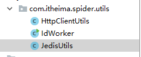

### 1.2 确定首页url

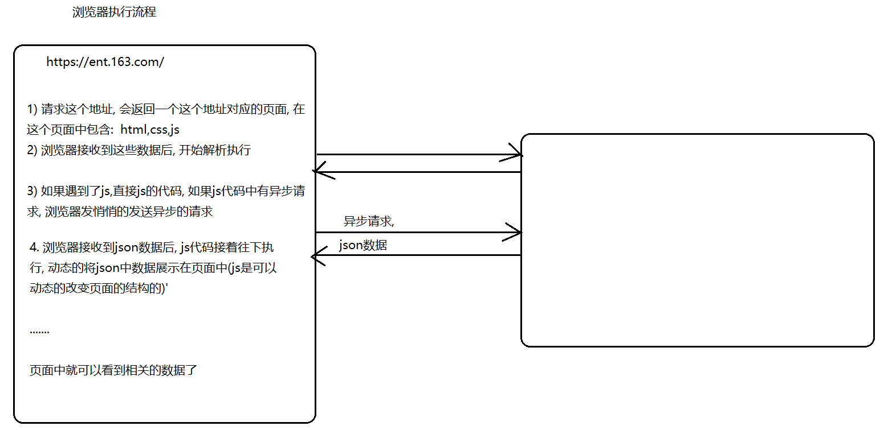

结论:  新闻数据, 不是通过同步请求, 获取到, 而是通过异步请求, 悄悄获取的

如何获取异步请求的url :

```url
首页的url : https://ent.163.com/special/000380VU/newsdata_index.js?callback=data_callback
分页的url :  https://ent.163.com/special/000380VU/newsdata_index_02.js?callback=data_callback
```

### 1.3 发送请求, 获取数据

```java
public class News163Spider {


    public static void main(String[] args )  throws  Exception{
        //1. 确定首页url:
        String indexUrl = "https://ent.163.com/special/000380VU/newsdata_index.js?callback=data_callback";
        //2. 发送请求, 获取数据
        // 此处获取的json的数据, 并不是一个标准的json
        String jsonStr = HttpClientUtils.doGet(indexUrl);
        jsonStr =  splitJson(jsonStr);
        System.out.println(jsonStr);

        //3. 解析数据(json) :
        /**
         * 1) json格式一共有几种:     二种  一般复合格式认为是前二种的扩展格式
         *      一种:  [value1,value2,value3 ....]    ---数组格式
         *      二种:  {key1:value1,key2:value2}
         *      三种:  {key1:[value1,value2]}
         *      四种:  [{},{}]
         *
         * 2) 如何区分一个json的格式是一个对象呢, 还是一个数组呢?
         *      查看最外层的符号即可, 如果是[] 那就是数组, 如果{}那就是对象
         *          [{key:[{key:value}]}] : 转回对应的类型
         *              List<Map<String,List<Map<String,String>>>>
         *
         *  3) json格式本质上就是一个字符串: 在js  和 java中表示的类型有所不同的:
         *           js                      java
         *    []    数组                    数组/List/set
         *    {}    对象                    javaBean对象/Map
         *
         *    js中如何定义一个对象:  var persion = {username:'张三'};   persion.username
         */


    }
    // 将非标准的json转换为标准的json字符串
    private static String splitJson(String jsonStr) {
        int firstIndex = jsonStr.indexOf("(");
        int lastIndex = jsonStr.lastIndexOf(")");

        return jsonStr.substring(firstIndex+1,lastIndex);

    }
}

```

### 1.4 解析数据(json)

* 解析新闻的列表页:

```java
// 解析json的方法
    private static void parseJson(String jsonStr) {
        //3.1 将json字符串转换成 指定的对象
        Gson gson = new Gson();

        List<Map<String, Object>> newsList = gson.fromJson(jsonStr, List.class);
        // 3.2 遍历整个新闻的结合, 获取每一个新闻的对象
        for (Map<String, Object> newsObj : newsList) {
            // 新闻 :  标题, 时间,来源 , 内容 , 新闻编辑  ,  新闻的url
            //3.2.1 获取新闻的url , 需要根据url, 获取详情页中新闻数据
            String docUrl = (String) newsObj.get("docurl");
            // 过滤掉一些不是新闻数据的url
            if(docUrl.contains("photoview")){
                continue;
            }
            if(docUrl.contains("v.163.com")){
                continue;
            }
            //System.out.println(docUrl);
            //3.2.2 获取新闻详情页的数据
            parseNewsItem(docUrl);

        }
    }
```

* 创建news类(pojo):

```java
// 新闻对象
public class News {
    private String id;
    private String title;
    private String time;
    private String source;
    private String content;
    private String editor;
    private String docurl;
	// 省略 get...  set... 方法
}
```

* 解析新闻的详情页的内容:

```java
// 根据url 解析新闻详情页:
    private static News parseNewsItem(String docUrl) throws  Exception {
        //  3.3.1 发送请求, 获取新闻详情页数据
        String html = HttpClientUtils.doGet(docUrl);

        //3.3.2 解析新闻详情页:
        Document document = Jsoup.parse(html);

        //3.3.2.1 :  解析新闻的标题:
        News news = new News();
        Elements h1El = document.select("#epContentLeft h1");
        String title = h1El.text();
        news.setTitle(title);

        //3.3.2.2 :  解析新闻的时间:
        Elements timeAndSourceEl = document.select(".post_time_source");

        String timeAndSource = timeAndSourceEl.text();

        String[] split = timeAndSource.split("　来源: ");// 请各位一定一定一定要复制, 否则会切割失败
        news.setTime(split[0]);
        //3.3.2.3 :  解析新闻的来源:
        news.setSource(split[1]);
        //3.3.2.4 :  解析新闻的正文:
        Elements ps = document.select("#endText p");
        String content = ps.text();
        news.setContent(content);
        //3.3.2.5 :  解析新闻的编辑:
        Elements spanEl = document.select(".ep-editor");
        // 责任编辑：陈少杰_b6952
        String editor = spanEl.text();
        // 一定要接收返回值, 否则白写了
        editor = editor.substring(editor.indexOf("：")+1,editor.lastIndexOf("_"));
        news.setEditor(editor);
        //3.3.2.6 :  解析新闻的url:
        news.setDocurl(docUrl);
        //3.3.2.7: id
        long id = idWorker.nextId();
        news.setId(id+"");

       return news;
    }
```

### 1.5 保存数据

* 准备工作: 创建对应的库 和 对应的表

```sql
create databases gossip;
use gossip;
SET FOREIGN_KEY_CHECKS=0;
DROP TABLE IF EXISTS `news`;
CREATE TABLE `news` (
  `id` varchar(20) NOT NULL,
  `title` varchar(100) DEFAULT NULL,
  `time` varchar(50) DEFAULT NULL,
  `source` varchar(50) DEFAULT NULL,
  `content` TEXT,
  `editor` varchar(50) DEFAULT NULL,
  `docurl` varchar(100) DEFAULT NULL,
  PRIMARY KEY (`id`)
) ENGINE=InnoDB DEFAULT CHARSET=utf8mb4;
```

* 1) 创建一个NewsDao类:

```java
package com.itheima.spider.dao;

import com.itheima.spider.pojo.News;
import com.mchange.v2.c3p0.ComboPooledDataSource;
import org.springframework.jdbc.core.JdbcTemplate;

import java.beans.PropertyVetoException;

public class NewsDao extends JdbcTemplate {

    public NewsDao() {
        ComboPooledDataSource dataSource = new ComboPooledDataSource();

        try {
            dataSource.setDriverClass("com.mysql.jdbc.Driver");
            dataSource.setJdbcUrl("jdbc:mysql:///gossip"); // 需要更改为自己的数据库名称
            dataSource.setUser("root");
            dataSource.setPassword("root"); // 需要更改为自己的mysql的密码
        } catch (PropertyVetoException e) {
            e.printStackTrace();
        }

        super.setDataSource(dataSource);
    }


    // 保存数据的方法
    public void saveNews(News news) {
        String[] params = {news.getId(), news.getTitle(), news.getTime(), news.getSource(), news.getContent(), news.getEditor(), news.getDocurl()};
        update("INSERT  INTO  news VALUES (?,?,?,?,?,?,?)", params);
    }
}

```

* 2) 在news163Spider类中, 执行保存即可

  * 在成员位置创建dao对象

  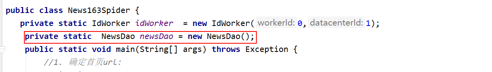

  * 在parseJson方法中添加一下内容

  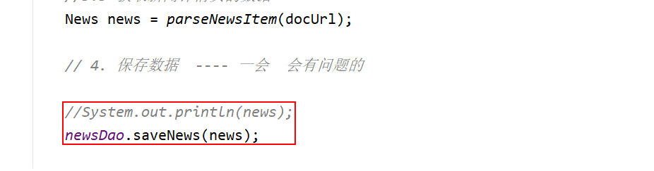


如果将创建dao的代码放置到了方法中, 后续可能会出现这个异常信息:  

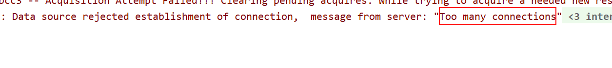

```
错误异常原因: 太多的连接,超过mysql的最大连接数了
	由于创建了太多的连接池了, 每一次创建一个连接池就会初始化一些连接
	创建了多次Dao对象, 每创建一次dao, 执行一下dao中构造方法, 构造方法中创建连接池对象
	

```


### 1.6 分页获取数据

```java
 // 执行分页的方法

    public static void  page(String indexUrl) throws  Exception{
        String page = "02";
        while(true) {
            //1. 发送请求获取数据
            // 此处获取的json的数据, 并不是一个非标准的json
            String jsonStr = HttpClientUtils.doGet(indexUrl);
            if(jsonStr==null){
                System.out.println("数据获取完成");
                break;
            }

            jsonStr = splitJson(jsonStr);

            //2. 解析数据, 3 保存数据
            parseJson(jsonStr);

            //4. 获取下一页的url
            indexUrl = "https://ent.163.com/special/000380VU/newsdata_index_" + page + ".js?callback=data_callback";

            //5. page ++
            int pageNum = Integer.parseInt(page);
            pageNum++;

            if(pageNum <10){
                page = "0"+pageNum;
            }else{
                page = pageNum+"";
            }
        }

    }
```

注意: 需要将main方法中原有的发送请求和解析数据的代码注释掉, 因为在page方法中已经执行一遍了

​	需要将page方法在main方法中调用

### 1.7 去重操作

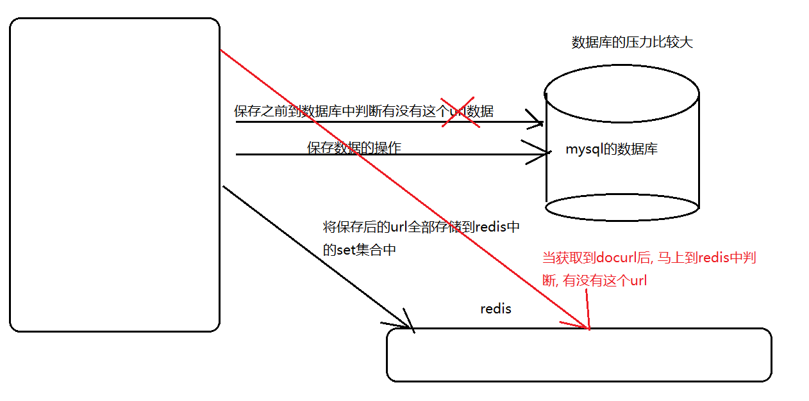

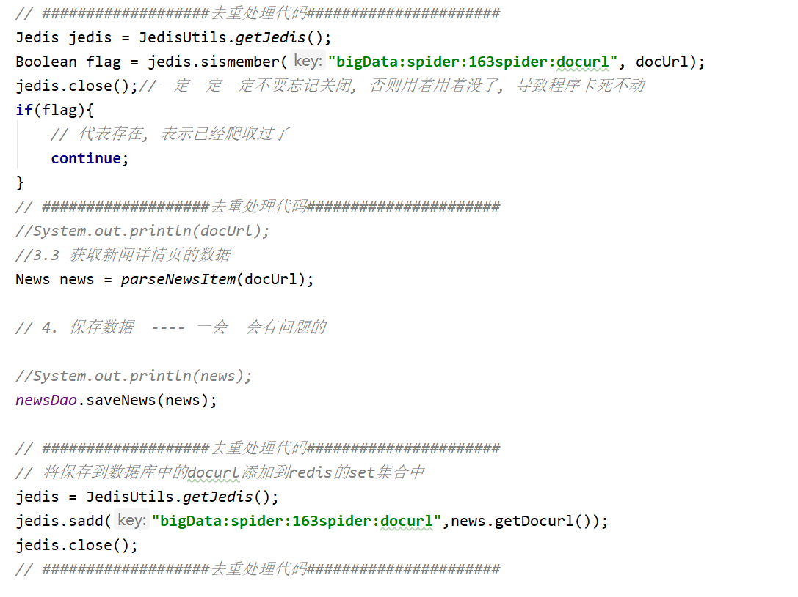


清空数据的时候, 一定要注意: 除了清空mysql中数据外, 还的清空redis中的数据

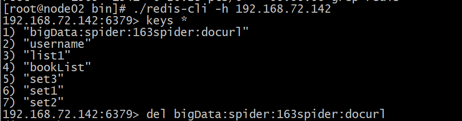


### 1.8 获取整个网易新闻中所有的娱乐信息

```
明星栏目首页url:  https://ent.163.com/special/000380VU/newsdata_star.js?callback=data_callback
明星栏目分页url:  https://ent.163.com/special/000380VU/newsdata_star_02.js?callback=data_callback

电影栏目首页url: https://ent.163.com/special/000380VU/newsdata_movie.js?callback=data_callback
电影栏目分页url : https://ent.163.com/special/000380VU/newsdata_movie_02.js?callback=data_callback

电视剧栏目首页url: https://ent.163.com/special/000380VU/newsdata_tv.js?callback=data_callback
电视剧栏目分页url: https://ent.163.com/special/000380VU/newsdata_tv_02.js?callback=data_callback

综艺栏目首页url: https://ent.163.com/special/000380VU/newsdata_show.js?callback=data_callback
综艺栏目分页url: https://ent.163.com/special/000380VU/newsdata_show_02.js?callback=data_callback

音乐栏目首页url: https://ent.163.com/special/000380VU/newsdata_music.js?callback=data_callback
音乐栏目分页url: https://ent.163.com/special/000380VU/newsdata_music_02.js?callback=data_callback
```


* 1) 在main方法中, 将所有的首页的url放置到集合中

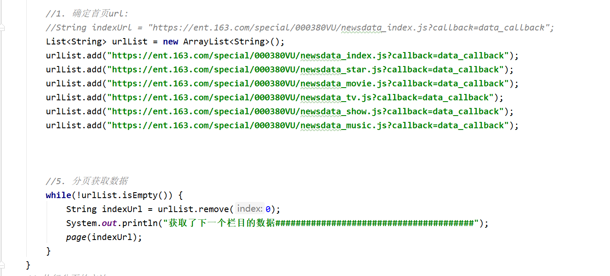

* 2) 在分页的方法中, 执行分页的时候, 也需要根据不同的地址进行分页

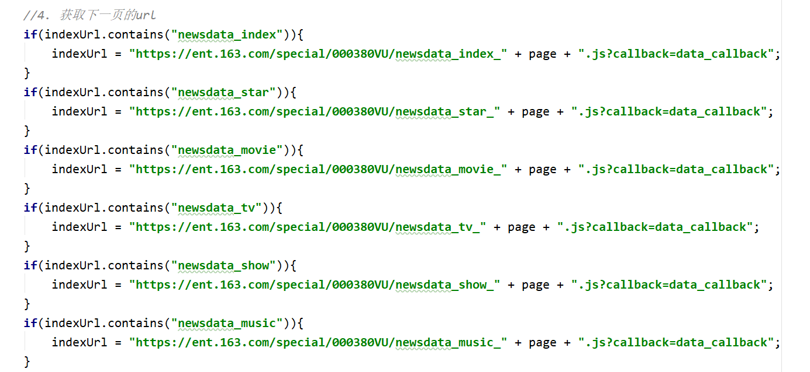


### 1.9 将整体的爬虫:

### 

```java
package com.itheima.spider.news163Spider;

import com.google.gson.Gson;
import com.itheima.spider.dao.NewsDao;
import com.itheima.spider.pojo.News;
import com.itheima.spider.utils.HttpClientUtils;
import com.itheima.spider.utils.IdWorker;
import com.itheima.spider.utils.JedisUtils;
import org.jsoup.Jsoup;
import org.jsoup.nodes.Document;
import org.jsoup.select.Elements;
import redis.clients.jedis.Jedis;


import java.util.ArrayList;
import java.util.List;
import java.util.Map;

public class News163Spider {
   private static IdWorker idWorker  = new IdWorker(0,1);
    private static  NewsDao newsDao = new NewsDao();
    public static void main(String[] args) throws Exception {

        //2. 发送请求, 获取数据
        // 此处获取的json的数据, 并不是一个非标准的json
        //String jsonStr = HttpClientUtils.doGet(indexUrl);
        //jsonStr = splitJson(jsonStr);
        // System.out.println(jsonStr);

        //3. 解析数据(json) :
        /**
         * 1) json格式一共有几种:     二种  一般见复合格式认为是前二种的扩展格式
         *      一种:  [value1,value2,value3 ....]    ---数组格式
         *      二种:  {key1:value1,key2:value2}
         *      三种:  {key1:[value1,value2]}
         *      四种:  [{},{}]
         *
         * 2) 如何区分一个json的格式是一个对象呢, 还是一个数组呢?
         *      查看最外层的符号即可, 如果是[] 那就是数组, 如果{}那就是对象
         *          [{key,[{key,value}]}] : 转回对应的类型
         *              List<Map<String,List<Map<String,String>>>>
         *
         *  3) json格式本质上就是一个字符串: 在js  和 java中表示的类型有所不同的:
         *           js                      java
         *    []    数组                    数组/List/set
         *    {}    对象                    javaBean对象/Map
         *
         *    js中如何定义一个对象:  var persion = {username:'张三'};   persion.username
         */
        //parseJson(jsonStr);


        //1. 确定首页url:
        //String indexUrl = "https://ent.163.com/special/000380VU/newsdata_index.js?callback=data_callback";
        List<String> urlList = new ArrayList<String>();
        urlList.add("https://ent.163.com/special/000380VU/newsdata_index.js?callback=data_callback");
        urlList.add("https://ent.163.com/special/000380VU/newsdata_star.js?callback=data_callback");
        urlList.add("https://ent.163.com/special/000380VU/newsdata_movie.js?callback=data_callback");
        urlList.add("https://ent.163.com/special/000380VU/newsdata_tv.js?callback=data_callback");
        urlList.add("https://ent.163.com/special/000380VU/newsdata_show.js?callback=data_callback");
        urlList.add("https://ent.163.com/special/000380VU/newsdata_music.js?callback=data_callback");


        //5. 分页获取数据
        while(!urlList.isEmpty()) {
            String indexUrl = urlList.remove(0);
            System.out.println("获取了下一个栏目的数据#######################################");
            page(indexUrl);
        }
    }
    // 执行分页的方法

    public static void  page(String indexUrl) throws  Exception{
        String page = "02";
        while(true) {
            //1. 发送请求获取数据
            // 此处获取的json的数据, 并不是一个非标准的json

            String jsonStr = HttpClientUtils.doGet(indexUrl);
            if(jsonStr==null){
                System.out.println("数据获取完成");
                break;
            }

            jsonStr = splitJson(jsonStr);

            //2. 解析数据, 3 保存数据
            parseJson(jsonStr);

            //4. 获取下一页的url
            if(indexUrl.contains("newsdata_index")){
                indexUrl = "https://ent.163.com/special/000380VU/newsdata_index_" + page + ".js?callback=data_callback";
            }
            if(indexUrl.contains("newsdata_star")){
                indexUrl = "https://ent.163.com/special/000380VU/newsdata_star_" + page + ".js?callback=data_callback";
            }
            if(indexUrl.contains("newsdata_movie")){
                indexUrl = "https://ent.163.com/special/000380VU/newsdata_movie_" + page + ".js?callback=data_callback";
            }
            if(indexUrl.contains("newsdata_tv")){
                indexUrl = "https://ent.163.com/special/000380VU/newsdata_tv_" + page + ".js?callback=data_callback";
            }
            if(indexUrl.contains("newsdata_show")){
                indexUrl = "https://ent.163.com/special/000380VU/newsdata_show_" + page + ".js?callback=data_callback";
            }
            if(indexUrl.contains("newsdata_music")){
                indexUrl = "https://ent.163.com/special/000380VU/newsdata_music_" + page + ".js?callback=data_callback";
            }


            //5. page ++
            int pageNum = Integer.parseInt(page);
            pageNum++;

            if(pageNum <10){
                page = "0"+pageNum;
            }else{
                page = pageNum+"";
            }
        }

    }

    // 解析json的方法
    private static void parseJson(String jsonStr)  throws  Exception{
        //3.1 将json字符串转换成 指定的对象
        Gson gson = new Gson();

        List<Map<String, Object>> newsList = gson.fromJson(jsonStr, List.class);
        // 3.2 遍历整个新闻的结合, 获取每一个新闻的对象
        for (Map<String, Object> newsObj : newsList) {
            // 新闻 :  标题, 时间,来源 , 内容 , 新闻编辑  ,  新闻的url
            //3.2.1 获取新闻的url , 需要根据url, 获取详情页中新闻数据
            String docUrl = (String) newsObj.get("docurl");
            // 过滤掉一些不是新闻数据的url
            if(docUrl.contains("photoview")){
                continue;
            }
            if(docUrl.contains("v.163.com")){
                continue;
            }
            if(docUrl.contains("c.m.163.com")){
                continue;
            }
            if(docUrl.contains("dy.163.com")){
                continue;
            }
            // ###################去重处理代码######################
            Jedis jedis = JedisUtils.getJedis();
            Boolean flag = jedis.sismember("bigData:spider:163spider:docurl", docUrl);
            jedis.close();//一定一定一定不要忘记关闭, 否则用着用着没了, 导致程序卡死不动
            if(flag){
                // 代表存在, 表示已经爬取过了
                continue;
            }
            // ###################去重处理代码######################
            //System.out.println(docUrl);
            //3.3 获取新闻详情页的数据
            News news = parseNewsItem(docUrl);

            // 4. 保存数据  ---- 一会  会有问题的

            //System.out.println(news);
            newsDao.saveNews(news);

            // ###################去重处理代码######################
            // 将保存到数据库中的docurl添加到redis的set集合中
            jedis = JedisUtils.getJedis();
            jedis.sadd("bigData:spider:163spider:docurl",news.getDocurl());
            jedis.close();
            // ###################去重处理代码######################

        }
    }
    // 根据url 解析新闻详情页:
    private static News parseNewsItem(String docUrl) throws  Exception {
        System.out.println(docUrl);
        //  3.3.1 发送请求, 获取新闻详情页数据
        String html = HttpClientUtils.doGet(docUrl);

        //3.3.2 解析新闻详情页:
        Document document = Jsoup.parse(html);

        //3.3.2.1 :  解析新闻的标题:
        News news = new News();
        Elements h1El = document.select("#epContentLeft h1");
        String title = h1El.text();
        news.setTitle(title);

        //3.3.2.2 :  解析新闻的时间:
        Elements timeAndSourceEl = document.select(".post_time_source");

        String timeAndSource = timeAndSourceEl.text();

        String[] split = timeAndSource.split("　来源: ");// 请各位一定一定一定要复制, 否则会切割失败
        news.setTime(split[0]);
        //3.3.2.3 :  解析新闻的来源:
        news.setSource(split[1]);
        //3.3.2.4 :  解析新闻的正文:
        Elements ps = document.select("#endText p");
        String content = ps.text();
        news.setContent(content);
        //3.3.2.5 :  解析新闻的编辑:
        Elements spanEl = document.select(".ep-editor");
        // 责任编辑：陈少杰_b6952
        String editor = spanEl.text();
        // 一定要接收返回值, 否则白写了
        editor = editor.substring(editor.indexOf("：")+1,editor.lastIndexOf("_"));
        news.setEditor(editor);
        //3.3.2.6 :  解析新闻的url:
        news.setDocurl(docUrl);
        //3.3.2.7: id
        long id = idWorker.nextId();
        news.setId(id+"");

       return news;
    }

    // 将非标准的json转换为标准的json字符串
    private static String splitJson(String jsonStr) {
        int firstIndex = jsonStr.indexOf("(");
        int lastIndex = jsonStr.lastIndexOf(")");

        return jsonStr.substring(firstIndex + 1, lastIndex);

    }
}

```

## 2. 爬取腾讯新闻娱乐数据

### 2.1 确定首页url

```
热点url : https://pacaio.match.qq.com/irs/rcd?cid=137&token=d0f13d594edfc180f5bf6b845456f3ea&ext=ent&num=60

非热点的首页url : https://pacaio.match.qq.com/irs/rcd?cid=146&token=49cbb2154853ef1a74ff4e53723372ce&ext=ent&page=0

非热点的分页url :https://pacaio.match.qq.com/irs/rcd?cid=146&token=49cbb2154853ef1a74ff4e53723372ce&ext=ent&page=0

```

### 2.2 发送请求, 获取数据

```java
// 腾讯娱乐新闻的爬虫
public class TencentNewsSpider {

    public static void main(String[] args) throws  Exception{
        //1. 确定首页url
        String topNewsUrl = "https://pacaio.match.qq.com/irs/rcd?cid=137&token=d0f13d594edfc180f5bf6b845456f3ea&ext=ent&num=60";
        String noTopNewsUrl = "https://pacaio.match.qq.com/irs/rcd?cid=146&token=49cbb2154853ef1a74ff4e53723372ce&ext=ent&page=0";

        //2. 发送请求, 获取数据
        String topNewsJsonStr = HttpClientUtils.doGet(topNewsUrl);
        String noTopNewsJsonStr = HttpClientUtils.doGet(noTopNewsUrl);

        System.out.println(topNewsJsonStr);
        System.out.println(noTopNewsJsonStr);

        //3. 解析数据 :
        parseJson(topNewsJsonStr);
        parseJson(noTopNewsJsonStr);

    }
    //  解析新闻数据
    private static void parseJson(String newsJsonStr) {
        
    }
}
```

### 2.3 解析新闻数据(json)

```java
	//解析新闻数据
    private static List<News> parseJson(String newsJsonStr) {
        //3.1 将字符串json数据转换为指定的类型:   map
        Gson gson = new Gson();
        Map<String,Object> map = gson.fromJson(newsJsonStr, Map.class);

        //3.2  获取data中数据 : 列表页中数据
        List<Map<String,Object>> newsList = (List<Map<String, Object>>) map.get("data");

        //3.3 遍历这个列表, 获取每一个新闻的数据
        List<News> tencentNewList = new ArrayList<News>();
        for (Map<String, Object> newsMap : newsList) {
            //3.3.1 封装news对象
            News news = new News();

            news.setTitle((String)newsMap.get("title"));
            news.setTime((String)newsMap.get("update_time"));
            news.setSource((String)newsMap.get("source"));
            news.setContent((String)newsMap.get("intro"));
            news.setEditor((String)newsMap.get("source"));
            news.setDocurl((String)newsMap.get("vurl"));

            news.setId(idWorker.nextId() +"");

            tencentNewList.add(news);
        }

        return tencentNewList;
    }
```

### 2.4  保存数据

* 1) 创建一个saveNews的方法:

```
// 保存数据的操作
    public static void saveNews(List<News> newsList) {

        for (News news : newsList) {
            newsDao.saveNews(news);
        }

    }
```

* 2) 在main方法中, 添加保存数据的操作

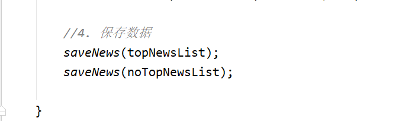

### 2.5 分页获取数据

```java
    // 执行分页的方法
    public static void page(String topNewsUrl,String noTopNewsUrl) throws  Exception{
        //1. 热点新闻数据的获取:  只有一页数据
        //1.1 发送请求, 获取数据
        String topNewsJsonStr = HttpClientUtils.doGet(topNewsUrl);
        //1.2 解析数据
        List<News> topNewsList = parseJson(topNewsJsonStr);
        //1.3 保存数据
        saveNews(topNewsList);

        //2. 处理非热点数据
        int page = 1;
        while(true){

            //2.1 发送请求, 获取数据
            String noTopNewsJsonStr = HttpClientUtils.doGet(noTopNewsUrl);
            //2.2 解析数据
            List<News> noTopNewsList = parseJson(noTopNewsJsonStr);

            if(noTopNewsList == null){
                break;
            }
            //2.3 保存数据
            saveNews(noTopNewsList);
            //2.4 获取下一页url
            noTopNewsUrl = "https://pacaio.match.qq.com/irs/rcd?cid=146&token=49cbb2154853ef1a74ff4e53723372ce&ext=ent&page="+page;

            //2.5 自增 +1
            page++;

            System.out.println(page);
        }


    }
```

* 过滤一些视频的链接:  在parseJson的方法中过滤的

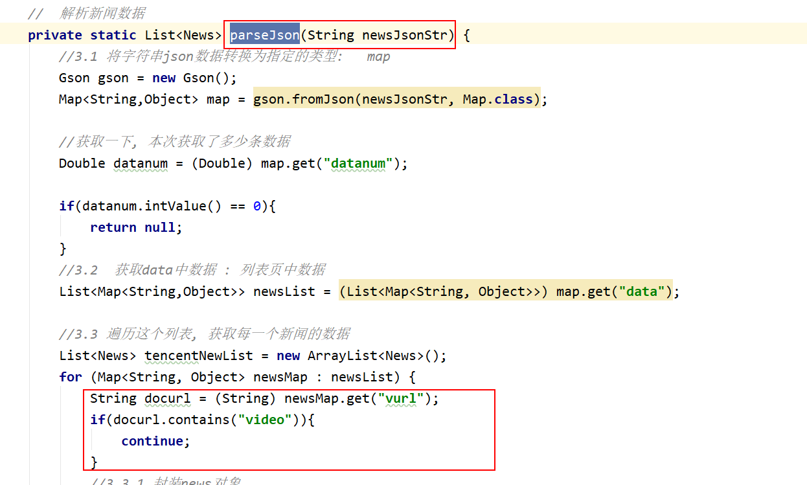

### 2.6 去重处理

* 1) 在获取docurl后, 需要判断, 这个url是否已经爬取过: parseJson方法中
  * 不需要在执行封装的代码了

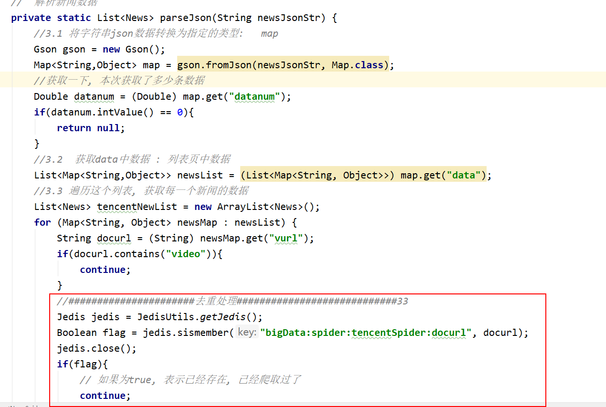

* 2) 在保存数据之前, 再次进行判断, 在保存之后, 将爬取过的url存储到redis中

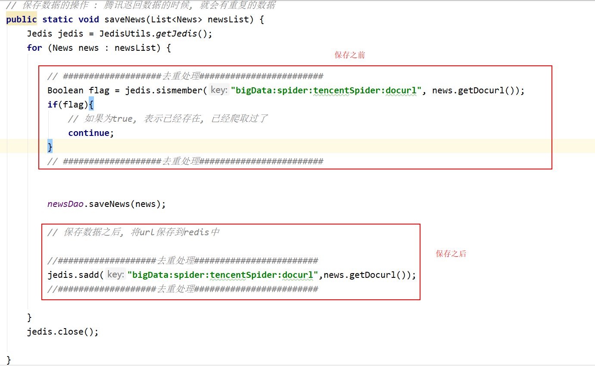

### 2.7 整体腾讯爬虫:

```java
package com.itheima.spider.tencent;

import com.google.gson.Gson;
import com.itheima.spider.dao.NewsDao;
import com.itheima.spider.pojo.News;
import com.itheima.spider.utils.HttpClientUtils;
import com.itheima.spider.utils.IdWorker;
import com.itheima.spider.utils.JedisUtils;
import redis.clients.jedis.Jedis;

import java.util.ArrayList;
import java.util.List;
import java.util.Map;

// 腾讯娱乐新闻的爬虫
public class TencentNewsSpider {
    private static IdWorker idWorker = new IdWorker(0,2);
    private static NewsDao newsDao = new NewsDao();
    public static void main(String[] args) throws  Exception{
        //1. 确定首页url
        String topNewsUrl = "https://pacaio.match.qq.com/irs/rcd?cid=137&token=d0f13d594edfc180f5bf6b845456f3ea&ext=ent&num=60";
        String noTopNewsUrl = "https://pacaio.match.qq.com/irs/rcd?cid=146&token=49cbb2154853ef1a74ff4e53723372ce&ext=ent&page=0";


        //2. 执行分页:
        page(topNewsUrl,noTopNewsUrl);

    }

    // 执行分页的方法
    public static void page(String topNewsUrl,String noTopNewsUrl) throws  Exception{
        //1. 热点新闻数据的获取:  只有一页数据
        //1.1 发送请求, 获取数据
        String topNewsJsonStr = HttpClientUtils.doGet(topNewsUrl);
        //1.2 解析数据
        List<News> topNewsList = parseJson(topNewsJsonStr);
        //1.3 保存数据
        saveNews(topNewsList);

        //2. 处理非热点数据
        int page = 1;
        while(true){

            //2.1 发送请求, 获取数据
            String noTopNewsJsonStr = HttpClientUtils.doGet(noTopNewsUrl);
            //2.2 解析数据
            List<News> noTopNewsList = parseJson(noTopNewsJsonStr);

            if(noTopNewsList == null){
                break;
            }
            //2.3 保存数据
            saveNews(noTopNewsList);
            //2.4 获取下一页url
            noTopNewsUrl = "https://pacaio.match.qq.com/irs/rcd?cid=146&token=49cbb2154853ef1a74ff4e53723372ce&ext=ent&page="+page;

            //2.5 自增 +1
            page++;

            System.out.println(page);
        }


    }

    // 保存数据的操作 : 腾讯返回数据的时候, 就会有重复的数据
    public static void saveNews(List<News> newsList) {
        Jedis jedis = JedisUtils.getJedis();
        for (News news : newsList) {

            // ###################去重处理########################
            Boolean flag = jedis.sismember("bigData:spider:tencentSpider:docurl", news.getDocurl());
            if(flag){
                // 如果为true, 表示已经存在, 已经爬取过了
                continue;
            }
            // ###################去重处理########################


            newsDao.saveNews(news);

            // 保存数据之后, 将url保存到redis中

            //###################去重处理########################
            jedis.sadd("bigData:spider:tencentSpider:docurl",news.getDocurl());
            //###################去重处理########################

        }
        jedis.close();

    }
    //  解析新闻数据
    private static List<News> parseJson(String newsJsonStr) {
        //3.1 将字符串json数据转换为指定的类型:   map
        Gson gson = new Gson();
        Map<String,Object> map = gson.fromJson(newsJsonStr, Map.class);
        //获取一下, 本次获取了多少条数据
        Double datanum = (Double) map.get("datanum");
        if(datanum.intValue() == 0){
            return null;
        }
        //3.2  获取data中数据 : 列表页中数据
        List<Map<String,Object>> newsList = (List<Map<String, Object>>) map.get("data");
        //3.3 遍历这个列表, 获取每一个新闻的数据
        List<News> tencentNewList = new ArrayList<News>();
        for (Map<String, Object> newsMap : newsList) {
            String docurl = (String) newsMap.get("vurl");
            if(docurl.contains("video")){
                continue;
            }
            //######################去重处理############################33
            Jedis jedis = JedisUtils.getJedis();
            Boolean flag = jedis.sismember("bigData:spider:tencentSpider:docurl", docurl);
            jedis.close();
            if(flag){
                // 如果为true, 表示已经存在, 已经爬取过了
                continue;
            }

            //######################去重处理############################33

            //3.3.1 封装news对象
            News news = new News();

            news.setTitle((String)newsMap.get("title"));
            news.setTime((String)newsMap.get("update_time"));
            news.setSource((String)newsMap.get("source"));
            news.setContent((String)newsMap.get("intro"));
            news.setEditor((String)newsMap.get("source"));
            news.setDocurl(docurl);

            news.setId(idWorker.nextId() +"");

            tencentNewList.add(news);

            System.out.println(docurl);
        }

        return tencentNewList;
    }
}

```


## 3. 梳理整个爬虫的流程

### 3.1 163娱乐爬虫的流程

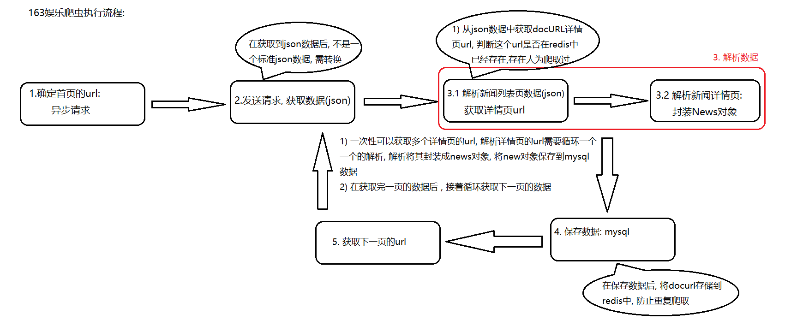

### 3.2 腾讯娱乐爬虫的流程

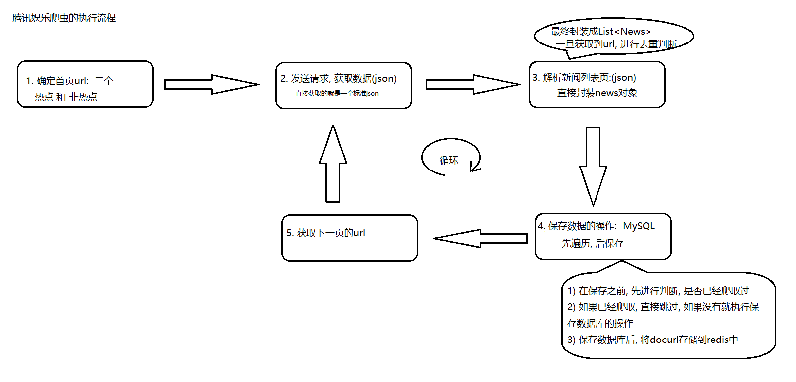


