# 娱乐头条 --- 爬虫部署

课前回顾:

* 163娱乐爬虫:

  * 1) 确定首页的url(异步请求)
  * 2)  发送请求, 获取数据(json):
    * 这个json并不是一个标准的json数据, 需要进行转换处理
  * 3) 解析数据
    * 3.1) 解析新闻的列表页: gson
      * 3.1.1) 使用gson 将数据转换为 List<Map>数据
      * 3.1.2) 遍历集合, 获取每一个map中数据:  一个个map就是一条条新闻的列表数据
      * 3.1.3)  从map中获取新闻的docurl: 从map中没有办法获取到新闻的所有信息
        * 获取到docurl后, 需要进行相关的过滤操作
        * 进行去重的判断
      * 3.1.4) 调用解析新闻的详情页的方法, 获取news对象
    * 3.2) 解析新闻的详情页:
      * 3.2.1: 发送请求, 获取数据(html)
      * 3.2.2:  解析数据:  jsoup
      * 3.2.3: 封装数据, news对象, 将news对象返回调用者
  * 4)  保存数据 : mysql
    * 保存后, 将docurl添加到redis中

  * 5) 获取下一页的url

* 腾讯娱乐爬虫:

今日内容:

* 爬虫的部署
  * 单机版本爬虫进行部署 : 部署的基本流程, maven的jar项目应该如何打包处理
  * 分布式爬虫的开发和部署 :  
  * 扩展:  爬虫的攻防技术: 能够拿自己的话说出来, 主要是为了面试
  * 扩展:  代理ip的技术


## 1. 单机版爬虫部署

### 1.1 部署准备工作:

* 1) 准备一台可以联网并且安装了redis、jdk1.8、mysql的虚拟机
  * 如果redis是单独放置了一台服务器, 那么一共就需要两台
  * 如果为两台服务器, 那么这两台服务器的防火墙都需要关闭
* 2) 在linux上mysql中创建相关的库和表
* 3) 查看程序dao中数据库连接相关的设置, 主要查看库和密码

### 1.2 对项目进行打包

> 注意: 在进行项目打包的过程中, 如果使用maven的项目. **而且maven的项目是一个jar项目, 在进行打包的时候必须添加打包插件**, 因为maven在进行jar工程打包的时候, 默认不会将这个jar工程所依赖第三方的jar打入到包中

* 1) 添加打包插件

> 需要注意, 在打包插件中有一个用于设置jar包的执行的主入口类的设置

````xml
<build>
        <plugins>
            <!--这是jdk编译的插件默认: 1.5 -->
            <plugin>
                <groupId>org.apache.maven.plugins</groupId>
                <artifactId>maven-compiler-plugin</artifactId>
                <version>3.1</version>
                <configuration>
                    <source>1.8</source>
                    <target>1.8</target>
                    <encoding>utf-8</encoding>
                </configuration>
            </plugin>
            <!--打包的插件-->
            <plugin>
                <artifactId>maven-assembly-plugin</artifactId>
                <configuration>
                    <archive>
                        <manifest> <!-- 注意 此为设置程序的主入口-->
                            <mainClass>com.itheima.jd.spider.SlaveJd</mainClass>
                        </manifest>
                    </archive>
                    <descriptorRefs>
                        <descriptorRef>jar-with-dependencies</descriptorRef>
                    </descriptorRefs>
                </configuration>
            </plugin>
        </plugins>
    </build>
````

* 2) 修改打包插件的主入口为 163娱乐新闻的入口类

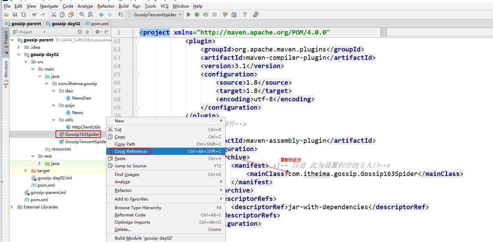

* 3) 对项目进行编译
  * 主要是由于idea默认不会自动编译, 为了避免因为没有编译, 导致无法执行的错误, 建议打包前进行编译

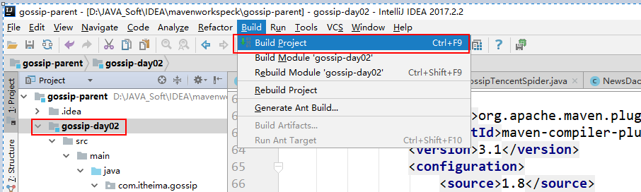

* 4) 执行打包操作
  * 这是打包插件已经提供好的

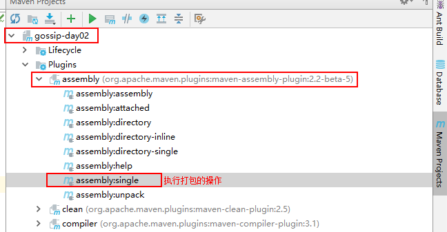

* 5) 执行完成后, 到对应打包位置, 查看是否打包成功

  * 这里主要检测jar包的主入口是否正确

  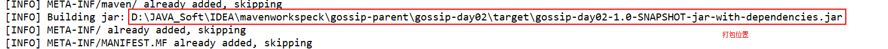

  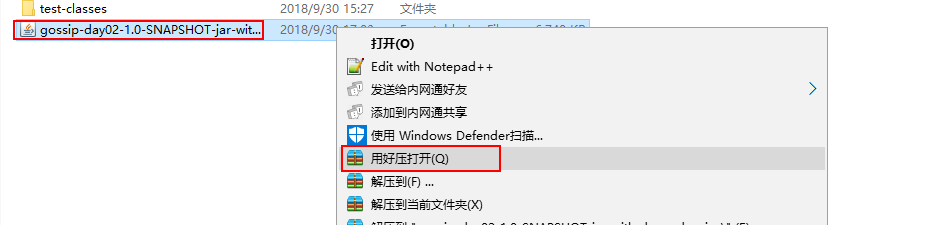

  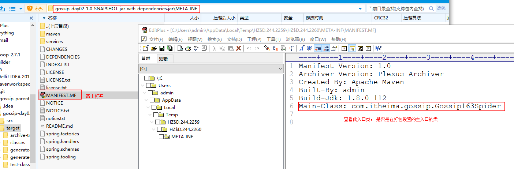

* 6) 打包成功后, 将此jar包复制出去, 建议改一个短的名称, 例如 newsSpider163
* 7) 在进行腾讯娱乐的爬虫的打包操作, 重复执行一下2~6步即可

### 1.3 将打包好的jar包进行上传

``` 
这里推荐使用的 rz 上传命令, 如果需要使用rz, 需要先按照rz命令

安装命令:   yum -y  install lrzsz

默认上传的位置就是输入rz命令的位置
上传命令: rz


上传的目录:  /export/servers/spider
	mkdir -p /export/servers/spider
	cd /export/servers/spider
	rz    #  上传
	
```

### 1.4 执行命令即可

```shell
java -jar  xxx.jar  即可
```

### 1.5 查看数据库中是否可以保存数据

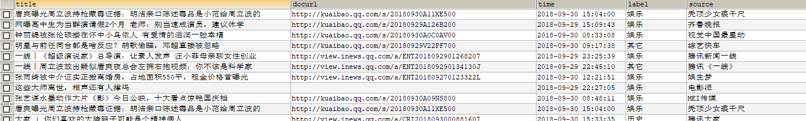

### 1.6 部署会出现的相关的问题


* 1) 数据库中出现乱码

```
解决方案:  在 dao类中, 连接数据库的字符串中添加如下内容:  characterEncoding=UTF-8
```

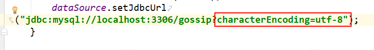

* 2) 无法保存到数据库(最多的问题)

```
出现的主要原因是 本地连接的密码, 有可能和远程连接的密码不一致, 执行下列操作, 修改本地和远程的密码

修改数据库密码
use mysql;
UPDATE user SET Password = PASSWORD('123456') WHERE user = 'root';
flush privileges; 

开启远程连接
use mysql;
grant all privileges on *.* to root@"%" identified by "123456" with grant option;
flush privileges;
```

>  执行上述命令后, 使用Navicat打开远程数据库, 删除下列数据即可

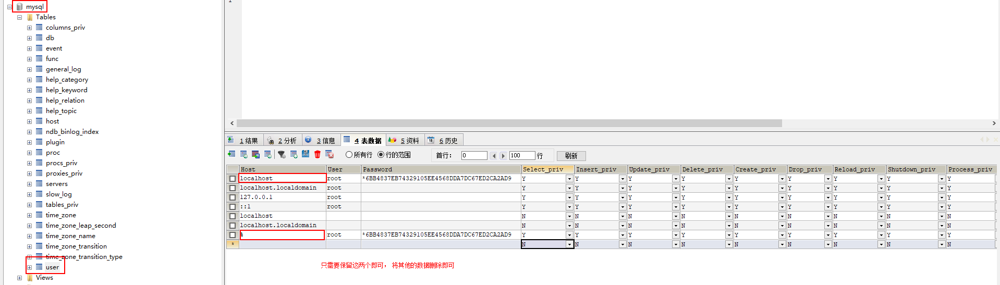

> 删除后, 然后重新启动mysql服务即可:  service mysql restart


* 在进行测试之前, 需要删除redis中的数据和MySQL中数据

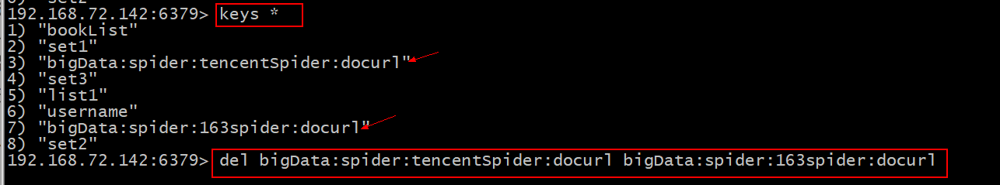

## 2. 分布式爬虫开发

### 2.1 什么是分布式, 分布式和集群的区别

* 分布式:  分布式指的就是某一个模块, 或者某个系统, 拆分成不同的业务,并进行分开部署, 

* 集群:     集群更多强调的是将相同的模块或者是系统, 重复部署多次

一般来说, 在大多数的情况下, 集群和分布式是同时存在, 共同作用于整个项目

- 通俗描述:

  - 小饭店原来只有一个厨师，切菜洗菜备料炒菜全干。

    后来客人多了，厨房一个厨师忙不过来，又请了个厨师，两个厨师都能炒一样的菜，这两个厨师的关系是集群。

    为了让厨师专心炒菜，把菜做到极致，又请了个配菜师负责切菜，备菜，备料，厨师和配菜师的关系是分布式。

    一个配菜师也忙不过来了，又请了个配菜师，两个配菜师关系是集群。

- 从刚才的案例中, 请分析出, 集群和分布式能解决什么样的问题?

  * 1) 主要解决单节点压力过大  
  * 2) 提高代码的复用性 :   
  * 3) 降低模块间或者各个子系统的耦合性

缺点:  提高开发难度

### 2.2 进行分布式爬虫编写

#### 2.2.1 为什么要进行分布式爬虫的改写

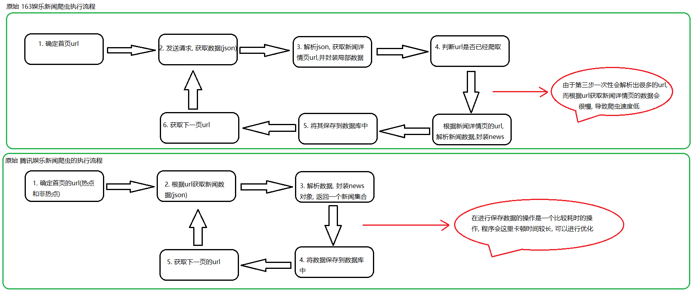

* 主要是由于程序的执行效率过低, 可以进行优化提升 

> 1) 专门用来获取163新闻详情页url程序
>
> 2) 专门用来解析163新闻详情页的程序  
>
> 3) 专门用来保存数据的程序  (公共的程序)
>
> 4) 专门用来获取腾讯新闻数据的程序


#### 2.2.2 分布式爬虫的架构

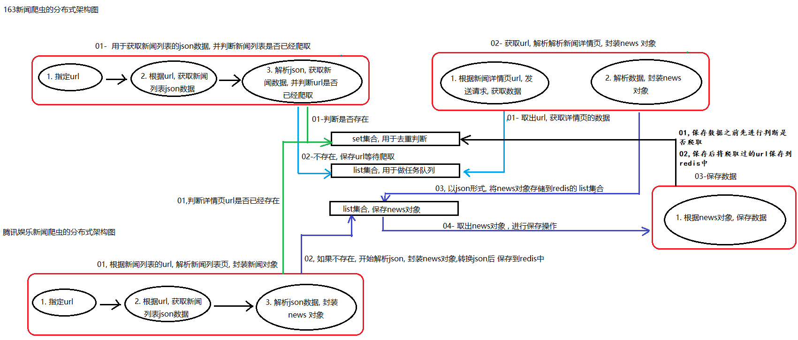


```
1) 用来执行去重的公共的key:  set
		bigData:spider:docurl  
2) 用来保存详情页docurl的key:  list
		bigData:spider:163itemUrl:docurl
3) 用来保存news对象key :  list
		bigData:spider:newsJson
```

#### 2.2.2 分布式爬虫开发:

##### 2.2.2.1 163分布式爬虫改进

> 说明: 163爬虫一共要拆分成三个子工程, 目前将第一个工程命名为News163Master 第二个工程命名为 News163Slave  第三个工程命名为 PublicDaoNode

* 1) News163Master  开发

```java
package com.itheima.spider.version2;
//需求:  获取详情页的url

import com.google.gson.Gson;
import com.itheima.spider.pojo.News;
import com.itheima.spider.utils.HttpClientUtils;
import com.itheima.spider.utils.JedisUtils;
import redis.clients.jedis.Jedis;

import java.util.ArrayList;
import java.util.List;
import java.util.Map;

/**
 * 1)  确定首页url 2) 发送请求, 获取数据 3) 解析数据 4) 去重判断  5) 将docurl保存到redis中 6) 获取下一页
 */
public class News163Master {

    public static void main(String[] args) throws Exception {

        //1. 确定首页url:
        List<String> urlList = new ArrayList<String>();
        urlList.add("https://ent.163.com/special/000380VU/newsdata_index.js?callback=data_callback");
        urlList.add("https://ent.163.com/special/000380VU/newsdata_star.js?callback=data_callback");
        urlList.add("https://ent.163.com/special/000380VU/newsdata_movie.js?callback=data_callback");
        urlList.add("https://ent.163.com/special/000380VU/newsdata_tv.js?callback=data_callback");
        urlList.add("https://ent.163.com/special/000380VU/newsdata_show.js?callback=data_callback");
        urlList.add("https://ent.163.com/special/000380VU/newsdata_music.js?callback=data_callback");

        //5. 分页获取数据
        while(!urlList.isEmpty()) {
            String indexUrl = urlList.remove(0);
            System.out.println("获取了下一个栏目的数据#######################################" );
            page(indexUrl);
        }
    }
    // 执行分页的方法

    public static void  page(String indexUrl) throws  Exception{
        String page = "02";
        while(true) {
            //1. 发送请求获取数据
            // 此处获取的json的数据, 并不是一个非标准的json

            String jsonStr = HttpClientUtils.doGet(indexUrl);
            if(jsonStr==null){
                System.out.println("数据获取完成");
                break;
            }
            // 转换为标准json方法
            jsonStr = splitJson(jsonStr);

            //2. 解析数据, 3 保存数据
            parseJson(jsonStr);

            //4. 获取下一页的url
            if(indexUrl.contains("newsdata_index")){
                indexUrl = "https://ent.163.com/special/000380VU/newsdata_index_" + page + ".js?callback=data_callback";
            }
            if(indexUrl.contains("newsdata_star")){
                indexUrl = "https://ent.163.com/special/000380VU/newsdata_star_" + page + ".js?callback=data_callback";
            }
            if(indexUrl.contains("newsdata_movie")){
                indexUrl = "https://ent.163.com/special/000380VU/newsdata_movie_" + page + ".js?callback=data_callback";
            }
            if(indexUrl.contains("newsdata_tv")){
                indexUrl = "https://ent.163.com/special/000380VU/newsdata_tv_" + page + ".js?callback=data_callback";
            }
            if(indexUrl.contains("newsdata_show")){
                indexUrl = "https://ent.163.com/special/000380VU/newsdata_show_" + page + ".js?callback=data_callback";
            }
            if(indexUrl.contains("newsdata_music")){
                indexUrl = "https://ent.163.com/special/000380VU/newsdata_music_" + page + ".js?callback=data_callback";
            }


            System.out.println(indexUrl);

            //5. page ++
            int pageNum = Integer.parseInt(page);
            pageNum++;

            if(pageNum <10){
                page = "0"+pageNum;
            }else{
                page = pageNum+"";
            }
        }

    }

    // 解析json的方法
    private static void parseJson(String jsonStr)  throws  Exception{
        //3.1 将json字符串转换成 指定的对象
        Gson gson = new Gson();

        List<Map<String, Object>> newsList = gson.fromJson(jsonStr, List.class);
        // 3.2 遍历整个新闻的结合, 获取每一个新闻的对象
        for (Map<String, Object> newsObj : newsList) {
            // 新闻 :  标题, 时间,来源 , 内容 , 新闻编辑  ,  新闻的url
            //3.2.1 获取新闻的url , 需要根据url, 获取详情页中新闻数据
            String docUrl = (String) newsObj.get("docurl");
            // 过滤掉一些不是新闻数据的url
            if(docUrl.contains("photoview")){
                continue;
            }
            if(docUrl.contains("v.163.com")){
                continue;
            }
            if(docUrl.contains("c.m.163.com")){
                continue;
            }
            if(docUrl.contains("dy.163.com")){
                continue;
            }
            // ###################去重处理代码######################
            Jedis jedis = JedisUtils.getJedis();
            Boolean flag = jedis.sismember("bigData:spider:docurl", docUrl);
            jedis.close();//一定一定一定不要忘记关闭, 否则用着用着没了, 导致程序卡死不动
            if(flag){
                // 代表存在, 表示已经爬取过了
                continue;
            }
            // ###################去重处理代码######################
            // 将docurl存储到redis的list集合中
            jedis = JedisUtils.getJedis();
            jedis.lpush("bigData:spider:163itemUrl:docurl",docUrl);
            jedis.close();

        }
    }
    // 将非标准的json转换为标准的json字符串
    private static String splitJson(String jsonStr) {
        int firstIndex = jsonStr.indexOf("(");
        int lastIndex = jsonStr.lastIndexOf(")");

        return jsonStr.substring(firstIndex + 1, lastIndex);

    }
}

```

* 2) News163Slave  开发

```java
package com.itheima.spider.version2;

import com.google.gson.Gson;
import com.itheima.spider.pojo.News;
import com.itheima.spider.utils.HttpClientUtils;
import com.itheima.spider.utils.IdWorker;
import com.itheima.spider.utils.JedisUtils;
import org.jsoup.Jsoup;
import org.jsoup.nodes.Document;
import org.jsoup.select.Elements;
import redis.clients.jedis.Jedis;

import java.util.List;

// 需求 :  解析新闻详情页的数据
// 步骤:  1) 从redis中获取docurl  2) 根据url解析商品的详情页 3) 封装成news对象  4) 将news对象转换为json数据
//          5) 将newsJson存储到redis的list中  6) 循环
public class News163Slave {
    private static IdWorker idWorker  = new IdWorker(0,1);
    public static void main(String[] args) throws Exception {
        while (true) {
            //1.从redis中获取docurl
            Jedis jedis = JedisUtils.getJedis();

            //String docurl = jedis.rpop("bigData:spider:163itemUrl:docurl");  // 取不到的时候出来
            //  第一个参数: 阻塞的时间   如果list中没有数据了, 就会进行阻塞, 最多阻塞20s. 如果在23s之内有数据进来, 马上解除阻塞
            // 返回值:  list    在这个list中只会有两个元素, 第一个元素为key值  第二个元素为弹出的元素
            List<String> list = jedis.brpop(20, "bigData:spider:163itemUrl:docurl");
            jedis.close();
            if(list == null || list.size()==0 ){
                break;
            }
            String docurl = list.get(1);
            //2. 根据url解析商品的详情页 封装成news对象
            News news = parseNewsItem(docurl);

            //3. 将news对象转换为json数据
            Gson gson = new Gson();
            String newsJson = gson.toJson(news);

            //4. 将newsJson存储到redis中
            jedis = JedisUtils.getJedis();
            jedis.lpush("bigData:spider:newsJson", newsJson);
            jedis.close();
        }
    }

    // 根据url 解析新闻详情页:
    private static News parseNewsItem(String docUrl) throws Exception {
        System.out.println(docUrl);
        //  3.3.1 发送请求, 获取新闻详情页数据
        String html = HttpClientUtils.doGet(docUrl);

        //3.3.2 解析新闻详情页:
        Document document = Jsoup.parse(html);

        //3.3.2.1 :  解析新闻的标题:
        News news = new News();
        Elements h1El = document.select("#epContentLeft h1");
        String title = h1El.text();
        news.setTitle(title);

        //3.3.2.2 :  解析新闻的时间:
        Elements timeAndSourceEl = document.select(".post_time_source");

        String timeAndSource = timeAndSourceEl.text();

        String[] split = timeAndSource.split("　来源: ");// 请各位一定一定一定要复制, 否则会切割失败
        news.setTime(split[0]);
        //3.3.2.3 :  解析新闻的来源:
        news.setSource(split[1]);
        //3.3.2.4 :  解析新闻的正文:
        Elements ps = document.select("#endText p");
        String content = ps.text();
        news.setContent(content);
        //3.3.2.5 :  解析新闻的编辑:
        Elements spanEl = document.select(".ep-editor");
        // 责任编辑：陈少杰_b6952
        String editor = spanEl.text();
        // 一定要接收返回值, 否则白写了
        editor = editor.substring(editor.indexOf("：") + 1, editor.lastIndexOf("_"));
        news.setEditor(editor);
        //3.3.2.6 :  解析新闻的url:
        news.setDocurl(docUrl);
        //3.3.2.7: id
        long id = idWorker.nextId();
        news.setId(id + "");

        return news;
    }
}

```

* 3) PublicDaoNode 开发

```java
package com.itheima.spider.version2;

import com.google.gson.Gson;
import com.itheima.spider.dao.NewsDao;
import com.itheima.spider.pojo.News;
import com.itheima.spider.utils.JedisUtils;
import redis.clients.jedis.Jedis;

import java.util.List;

// 需求 : 公共的保存数据库的程序:
// 步骤:  1) 从redis中获取newsJson数据   2) 将newsJson转换成news对象  3) 去重判断  4) 保存数据
//       5) 将docurl存储到redis的去重的set集合中   6) 循环
public class PublicDaoNode {
    private static NewsDao newsDao = new NewsDao();

    public static void main(String[] args) {

        while(true) {
            //1) 从redis中获取newsJson数据
            Jedis jedis = JedisUtils.getJedis();
            List<String> list = jedis.brpop(20, "bigData:spider:newsJson");
            jedis.close();
            if (list == null || list.size() == 0) {
                break;
            }
            String newsJson = list.get(1);
            System.out.println(newsJson);
            //2. 将newsJson转换成news对象
            Gson gson = new Gson();
            News news = gson.fromJson(newsJson, News.class);

            //3) 去重判断
            jedis = JedisUtils.getJedis();
            Boolean flag = jedis.sismember("bigData:spider:docurl", news.getDocurl());
            jedis.close();

            if (flag) {
                continue;
            }
            //4) 保存数据

            newsDao.saveNews(news);

            // 5)  将docurl存储到redis的去重的set集合中
            jedis = JedisUtils.getJedis();
            jedis.sadd("bigData:spider:docurl", news.getDocurl());
            jedis.close();
        }

    }

}
```

##### 2.2.2.2 腾讯娱乐分布式爬虫改进

> 说明: 腾讯娱乐爬虫需要拆分成二个子工程, 一个子工程用于获取数据,封装news对象, 一个公共的子工程用于保存数据, 其中公共的已经开发完毕, 只需要拆分另一个子工程名为NewsTencentMaster即可

* 1) NewsTencentMaster 开发

```java
package com.itheima.spider.version2;


import com.google.gson.Gson;
import com.itheima.spider.pojo.News;
import com.itheima.spider.utils.HttpClientUtils;
import com.itheima.spider.utils.IdWorker;
import com.itheima.spider.utils.JedisUtils;
import redis.clients.jedis.Jedis;
import sun.security.jgss.GSSCaller;

import java.util.ArrayList;
import java.util.List;
import java.util.Map;
// 需求 :  解析数据, 封装成news对象, 将news对象保存到redis中
//  1) 确定首页url  2) 发送请求, 获取数据  3) 解析数据 4)  去重判断  5) 封装news对象  6) 将news对象转换为newsJson
//  7) 将newsJson保存到Redis中   8) 分页获取
public class NewsTencentMaster {
    private static IdWorker idWorker = new IdWorker(0,2);

    public static void main(String[] args) throws Exception {
        //1. 确定首页url
        String topNewsUrl = "https://pacaio.match.qq.com/irs/rcd?cid=137&token=d0f13d594edfc180f5bf6b845456f3ea&ext=ent&num=60";
        String noTopNewsUrl = "https://pacaio.match.qq.com/irs/rcd?cid=146&token=49cbb2154853ef1a74ff4e53723372ce&ext=ent&page=0";

        //2. 执行分页:
        page(topNewsUrl, noTopNewsUrl);

    }

    // 执行分页的方法
    public static void page(String topNewsUrl, String noTopNewsUrl) throws Exception {
        //1. 热点新闻数据的获取:  只有一页数据
        //1.1 发送请求, 获取数据
        String topNewsJsonStr = HttpClientUtils.doGet(topNewsUrl);
        //1.2 解析数据
        List<News> topNewsList = parseJson(topNewsJsonStr);
        //1.3 保存数据
        saveNews(topNewsList);

        //2. 处理非热点数据
        int page = 1;
        while (true) {

            //2.1 发送请求, 获取数据
            String noTopNewsJsonStr = HttpClientUtils.doGet(noTopNewsUrl);
            //2.2 解析数据
            List<News> noTopNewsList = parseJson(noTopNewsJsonStr);

            if (noTopNewsList == null) {
                break;
            }
            //2.3 保存数据
            saveNews(noTopNewsList);
            //2.4 获取下一页url
            noTopNewsUrl = "https://pacaio.match.qq.com/irs/rcd?cid=146&token=49cbb2154853ef1a74ff4e53723372ce&ext=ent&page=" + page;

            //2.5 自增 +1
            page++;

            System.out.println(page);
        }


    }

    // 保存数据的操作 : 腾讯返回数据的时候, 就会有重复的数据
    public static void saveNews(List<News> newsList) {
        Jedis jedis = JedisUtils.getJedis();
        Gson gson = new Gson();
        for (News news : newsList) {
            // 需要将news对象转换为newsJson
            String newsJson = gson.toJson(news);

            // 将newsJson存储到redis的list集合中
            jedis.lpush("bigData:spider:newsJson",newsJson);
        }
        jedis.close();

    }

    //  解析新闻数据
    private static List<News> parseJson(String newsJsonStr) {
        //3.1 将字符串json数据转换为指定的类型:   map
        Gson gson = new Gson();
        Map<String, Object> map = gson.fromJson(newsJsonStr, Map.class);
        //获取一下, 本次获取了多少条数据
        Double datanum = (Double) map.get("datanum");
        if (datanum.intValue() == 0) {
            return null;
        }
        //3.2  获取data中数据 : 列表页中数据
        List<Map<String, Object>> newsList = (List<Map<String, Object>>) map.get("data");
        //3.3 遍历这个列表, 获取每一个新闻的数据
        List<News> tencentNewList = new ArrayList<News>();
        for (Map<String, Object> newsMap : newsList) {
            String docurl = (String) newsMap.get("vurl");
            if (docurl.contains("video")) {
                continue;
            }
            //######################去重处理############################33
            Jedis jedis = JedisUtils.getJedis();
            Boolean flag = jedis.sismember("bigData:spider:docurl", docurl);
            jedis.close();
            if (flag) {
                // 如果为true, 表示已经存在, 已经爬取过了
                continue;
            }

            //######################去重处理############################33

            //3.3.1 封装news对象
            News news = new News();

            news.setTitle((String) newsMap.get("title"));
            news.setTime((String) newsMap.get("update_time"));
            news.setSource((String) newsMap.get("source"));
            news.setContent((String) newsMap.get("intro"));
            news.setEditor((String) newsMap.get("source"));
            news.setDocurl(docurl);

            news.setId(idWorker.nextId() + "");

            tencentNewList.add(news);

            System.out.println(docurl);
        }

        return tencentNewList;


    }
}

```

> 注意: 开发完成以后., 一定要进行测试:如果能够在本地全部跑通, 才可以进行部署, 否则不要进行部署

* 测试:
  * 1) 清空数据: redis  和 mysql
  * 2) 修改一个dao连接内容(修改本地连接)
  * 3) 分别启动四个程序即可: 可以不分先后顺序


## 3. 进行分布式爬虫的部署

### 3.1 部署方案

> 说明: 目前一共有四个子项目, 其中二个master各占用一台虚拟机, 其中一个用来解析新闻详情页, 可以部署一个两台的集群, 其中一个用来保存数据的, 可以部署三台,构建一个集群, 一共为七台, 外加一台mysql和一台redis, 共需要九台服务器

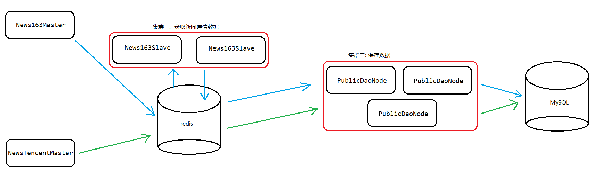

* 本次仅仅是模拟部署, 故采用三台服务器来模拟九台服务器:(实际中真实的九台服务器)
  * 1) 三台服务器都可以上网, 并都安装有jdk1.8以上
  * 2) 三台服务器的防火墙均已关闭(实际中开放端口号)
  * 3) 其中有一台需要安装 MySQL  其中一台安装 Redis,并均已正常开启,mysql必须开启远程登录

### 3.2 部署准备工作

* 1) 检测linux环境:

  * 1.1) 使用 ping 命令检测三台是否可以联网,并都安装有jdk1.8
    * 注意:  Windows电脑上的jdk  和 linux上的jdk需要保持一致
  * 1.2) 使用 service iptables status 查看是否关闭防火墙
  * 1.3) 检测MySQL:
    * 1.3.1) 在linux中能否正常连接mysql
    * 1.3.2) 在sqlyog中远程连接mysql是否正常
    * 1.3.3) linux和sqlyog连接MySQL的密码需要保持一致, 以免出现存储不进去的问题
  * 1.4)  使用 ps -ef | grep redis  检测redis是否正常启动

* 将项目进行打包:一共有四个子项目, 共需要打包四个jar

  * 0) 修改NewsDao中连接数据库相关设置

  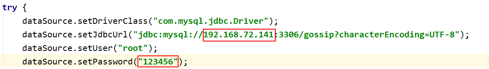


  * 1) 添加打包插件:

  ```xml
  <plugins>
              <!--这是jdk编译的插件 -->
              <plugin>
                  <groupId>org.apache.maven.plugins</groupId>
                  <artifactId>maven-compiler-plugin</artifactId>
                  <version>3.1</version>
                  <configuration>
                      <source>1.8</source>
                      <target>1.8</target>
                      <encoding>utf-8</encoding>
                  </configuration>
              </plugin>
              <!--打包的插件-->
              <plugin>
                  <artifactId>maven-assembly-plugin</artifactId>
                  <configuration>
                      <archive>
                          <manifest> <!-- 注意 此为设置程序的主入口-->
                              <mainClass>com.itheima.jdSpider.JdSlave</mainClass>
                          </manifest>
                      </archive>
                      <descriptorRefs>
                          <descriptorRef>jar-with-dependencies</descriptorRef>
                      </descriptorRefs>
                  </configuration>
              </plugin>
          </plugins>
  ```

  * 2) 修改打包插件中的主入口:

  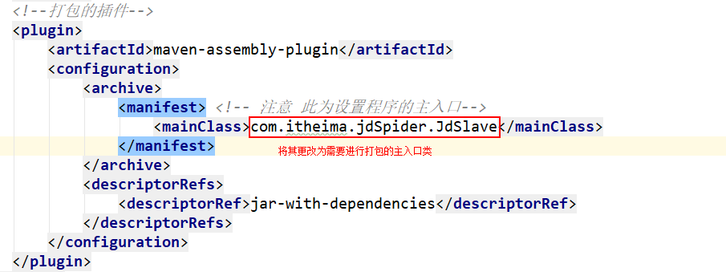

  * 3) 将项目进行编译

  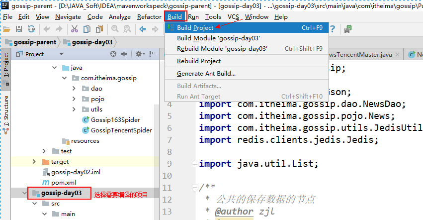

  * 4) 进行打包操作:

  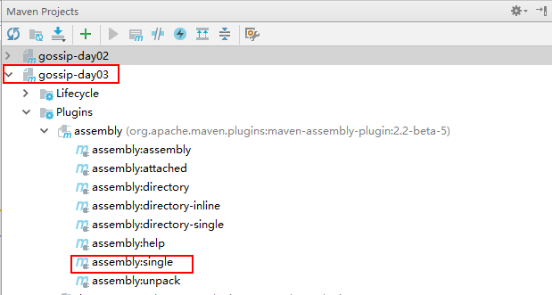

  * 5) 打包成功后, 会在打包过程中提示打包的位置

  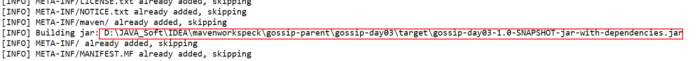

  * 6) 打开此位置, 查看此jar包中主入口是否是刚才是设置的主入口类

  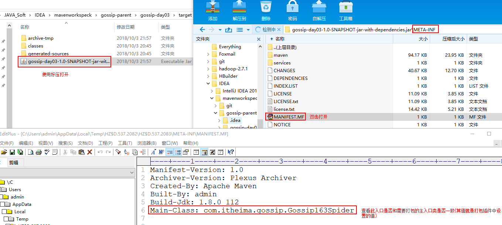

  * 7) 将其进行更该成对应的jar包的名称后, 放置一个适当的位置等待上传
  * 8) 重复执行以上2~ 7 步, 将四个jar包都要打包出来
    * **特别注意: 不要忘记修改主入口类(程序的入口)和 打包前进行编译**


注意: 需要单独对163slave程序再次进行打包操作. 在导包的时候, 需要修改idwork中编号,否则在部署的时候, 会出现id冲突的问题

```
因为, IDwork如果编号都一致了, 那么在同一时刻产生的id值是一样的
```

### 3.3 进行分布式部署

* 注意, 在开启这三个服务器连接窗口的时候, 一定要三个一起开

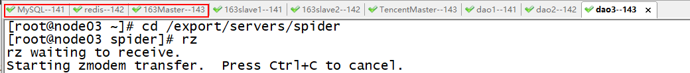

>  使用三台虚拟机模拟9台服务器, 其本质上就是使用xshell 或者 CRT 将三台虚拟机的连接窗口开启各开启三次即可, 然后自己进行分配, 那一台是MySQL, 那一台是Redis, 那一台是master....

```
统一jar包上传至 ; /export/servers/spider 目录下

mkdir -p /export/servers/spider
rm -rf /export/servers/spider/*
cd /export/servers/spider
```

* 1) 将对应的jar包上传到 服务器中, 推荐使用 rz进行上传
  * 将jar包上传至每个服务器的: /export/servers/spider

```
1) 安装 rz 命令:
	安装命令:  yum -y install lrzsz
2) 上传命令:  rz
注意: 上传的位置和输入rz命令的位置是一样的
```

* 2) 启动各个jar包即可: 推荐先启动获取数据的集群, 后启动 解析数据的集群, 最后启动两个master

```
启动命令:  java -jar  xxx.jar
```

******************


将爬虫设置为定时执行获取数据的操作:  目前采用的shell脚本的方式来操作

需求: 每二十分钟执行一次爬虫程序, 用于爬取最新的新闻信息

实现步骤:

- 1) 更改hosts文件(此步骤需要在每一个centos中配置)

```
vi /etc/hosts

修改如下内容:
192.168.72.141  node01
192.168.72.142  node02
192.168.72.143  node03


三台服务器必须要配置免密登录
```

- 2) 编写shell脚本:

  > 注意:  在进行修改shell脚本的时候, 一定要明确, 那台机子上部署了什么jar包

```shell
vi startSpider.sh
i
#脚本内容:  以下脚本为示例内容, 只提供大体逻辑, 根据实际进行局部修改

#!/bin/sh
echo "开始执行"

for host in node01 node02 node03
do
   ssh -q $host "source /etc/profile; nohup java -jar /export/servers/spider/PublicDaoNode.jar >>/dev/daoLog.log 2>&1 &"
   if [ $host == node01 ]
        then
   ssh -q $host "source /etc/profile; nohup java -jar /export/servers/spider/News163Slave.jar >>/dev/163Slave.log 2>&1 &"
   fi
   if [ $host == node02 ]
        then
   ssh -q $host "source /etc/profile; nohup java -jar /export/servers/spider/News163Slave.jar >>/dev/163Slave.log 2>&1 &"
   fi
   if [ $host == node03 ]
        then
   ssh -q $host "source /etc/profile; nohup java -jar /export/servers/spider/News163Master.jar >>/dev/163Master.log 2>&1 &"
   ssh -q $host "source /etc/profile; nohup java -jar /export/servers/spider/NewsTencentMaster.jar >>/dev/tencent.log 2>&1 &"
   fi
done


echo "结束了"
```

* 3) 编写定时任务: 推荐定时任务和当前shell脚本在同一台虚拟机中

```
crontab -e          // 设置定时, 输入完成后会自动进入一个设置文档中
输入 i  进入编辑模式
*/10 * * * * sh /export/servers/spider/startSpider.sh     // 表示每隔10分钟执行一次 启动爬虫的脚本
输入 esc 退出命令行模式, 输入 :wq  保存退出即可
```

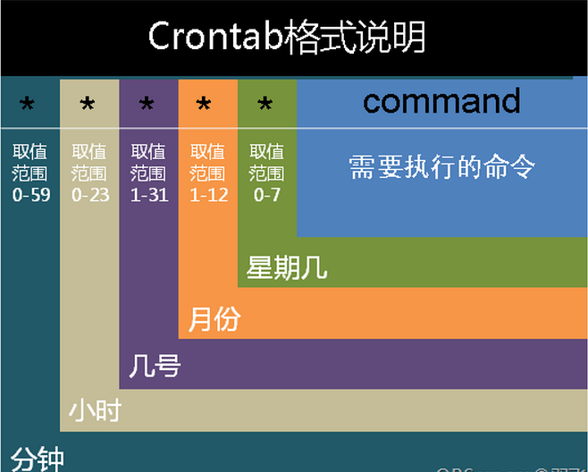

## 4. 扩展 -- 爬虫的攻防技术

掌握的程度: 能够拿自己的话, 将攻防技术说出来即可

- 如何发现一个爬虫？一般情况下网站是不会大量的验证用户请求.除非你在访问重要数据. 或者正常用户访问    
  - 1）单一的访问频次过高
    - 普通人,10秒访问一个网页, 爬虫一秒获取10个网页
  - 2)单一的ip出现非常规的流量  
  - 3) 大量的重复简单的网页浏览行为: 
  - 4) 只下载html文档, 不下载js
  - 5) 在页面设置陷阱, 用户看不懂, 爬虫是可以的, 比如 hidden  :  
  - 6) 在页面写一段js代码, 浏览器直接执行, 程序不会执行 :  百度贴吧
  - 7) 判断请求头: user-agent 
- 如何不被发现？
  - 多主机的策略, 解决单一ip的问题, 分布式爬取
  - 调整访问频次, 爬一会休息一下
  - **通过不断切换ip, 或者直接使用ip代理的形式**   (万能)
  - 频繁的修改user-agent头
    - https://blog.csdn.net/tao_627/article/details/42297443
  - Header中的Cache-Control修改为no-cache : 保证每一次访问都是一个全新的请求
  - 当返回状态码是403（服务器资源禁止访问），改变Header和IP。不断改变

```java
public static void main(String[] args) throws Exception {
		HttpGet httpGet = new HttpGet("https://news.163.com/");
		
      	//我是专门用来模拟浏览器，让我的请求看起来和真实的浏览器一样
		httpGet.setHeader("Accept", "text/html,application/xhtml+xml,application/xml;q=0.9,image/webp,*/*;q=0.8");
		httpGet.setHeader("Accept-Encoding", "gzip, deflate, sdch, br");
		httpGet.setHeader("Accept-Language", "zh-CN,zh;q=0.8");
		httpGet.setHeader("Cache-Control", "no-cache");
		httpGet.setHeader("Cookie", "_ntes_nnid=4b1a6bbc71e14269912bdc23980b3fb1,1531559784738; _ntes_nuid=4b1a6bbc71e14269912bdc23980b3fb1;");
		httpGet.setHeader("Host", "news.163.com");
		httpGet.setHeader("User-Agent", "Mozilla/5.0 (Windows NT 10.0; WOW64) AppleWebKit/537.36 (KHTML, like Gecko) Chrome/55.0.2883.87 Safari/537.36");
  		httpGet.setHeader("referer","http://news.163.com/");
		
		CloseableHttpClient httpClient = HttpClients.createDefault();
		CloseableHttpResponse res = httpClient.execute(httpGet);
		HttpEntity entity = res.getEntity();
		String html = EntityUtils.toString(entity,"utf-8");
		System.out.println(html);
	}
```

## 5. 扩展 --  使用代理IP优化爬虫

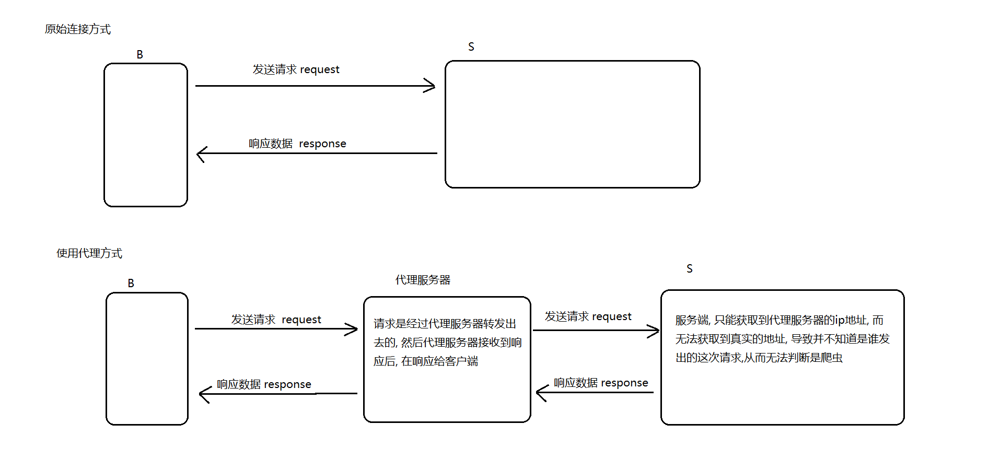

总结: 使用代理服务器(ip)可以掩盖爬虫程序所在的服务器的真实ip地址, 导致另一方无法获取到其真实的ip,也就无法将其截获

### 5.1 代理ip获取的途径

#### 5.1.1 从代理ip网站的上获取免费的ip地址,将其全部爬取下来

- 例如: http://www.xicidaili.com/  西刺代理

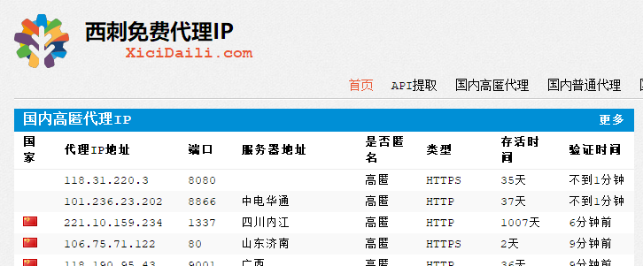

- http://ip.zdaye.com/FreeIPlist.html  站大爷


#### 5.1.2 购买代理ip

- 淘宝购买: (最便宜的1块钱 1000个, 但不是都可以用)
- 使用阿里云的弹性公网ip : 抢占模式   
- 购买正规的ip代理商,稳定, 价格高

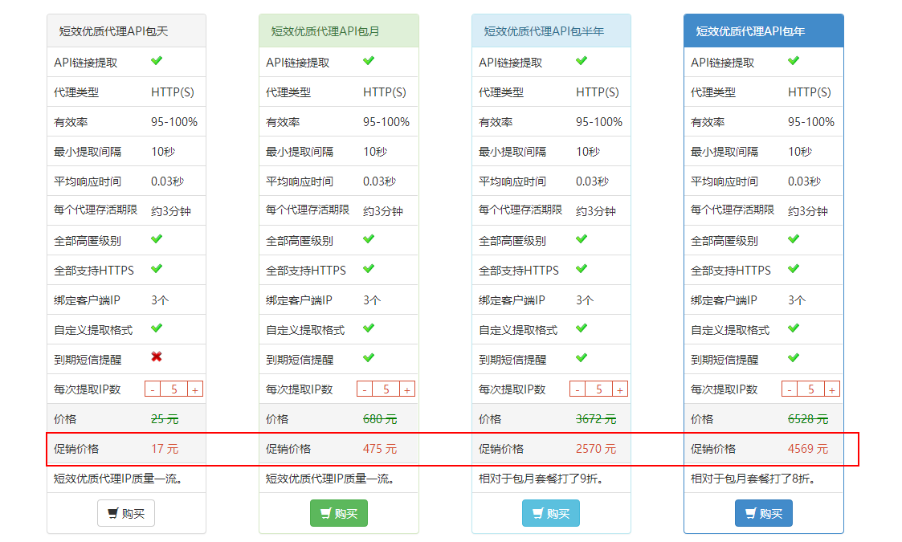

参考文章：说说代理IP哪家好  https://www.zhihu.com/question/55807309


火箭代理购买

网址：http://www.httpdaili.com/

购买：淘宝链接 https://item.taobao.com/item.htm?id=557165570553

提取：http://www.httpdaili.com/#c-5

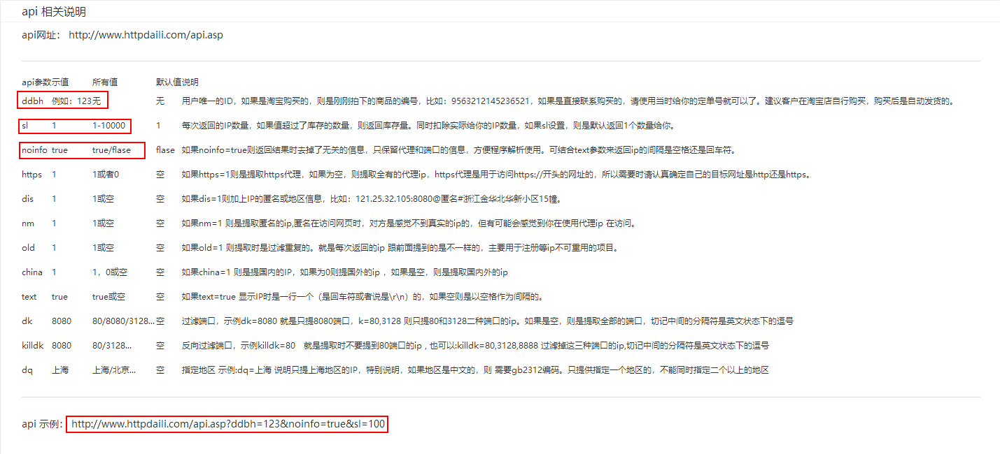

### 5.2 检测代理ip可用性

使用花刺软件验证带来IP是否可用

​	使用资料中提供的花刺软件进行检测即可

- 解压之后启动程序

  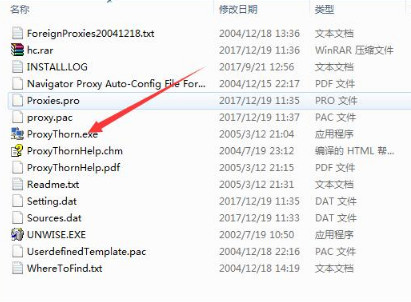

- 粘贴购买的代理IP

  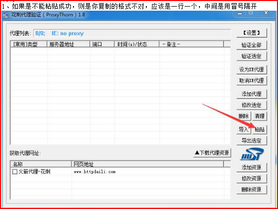

- 选择验证

  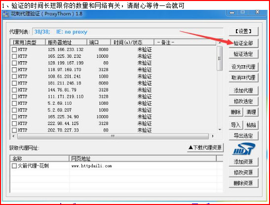

- 去除连接失败、响应时间比较长的,最后导出

  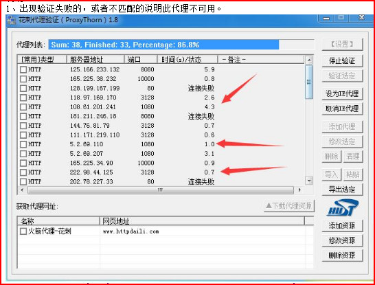

### 5.3  如何使用代理ip

http://hc.apache.org/httpcomponents-client-4.5.x/tutorial/html/connmgmt.html#d5e485

```java
HttpHost proxy = new HttpHost("someproxy", 8080);
DefaultProxyRoutePlanner routePlanner = new DefaultProxyRoutePlanner(proxy);
CloseableHttpClient httpclient = HttpClients.custom()
        .setRoutePlanner(routePlanner)
        .build();
```

#### 5.3.1 集成在代码中

- 将代理的ip存放到redis中，存储类型list。

```java
public void testInitIP() throws Exception {
		Jedis conn = JedisUtil.getConn();
		BufferedReader bufferedReader = new BufferedReader(
				new FileReader(new File("C:\\Users\\maoxiangyi\\Desktop\\Proxies2018-06-06.txt")));
		String line = null;
		while ((line=bufferedReader.readLine())!=null) {
			conn.lpush("spider:ip", line);
		}
		bufferedReader.close();
		conn.close();
	}
```

- 重构后的httpclient

```java
	private static String execute(HttpRequestBase request) {

		RequestConfig requestConfig = RequestConfig.custom().setConnectTimeout(5000)// 设置创建连接的最长时间
				.setConnectionRequestTimeout(5000)// 设置获取连接的最长时间
				.setSocketTimeout(10 * 1000)// 设置数据传输的最长时间
				.build();
		request.setConfig(requestConfig);

		String html = null;

		// 从redis中获取代理IP
		Jedis conn = JedisUtil.getConn();
		// 从右边弹出一个元素之后，从新放回左边
		List<String> ipkv = conn.brpop(0, "spider:ip");
		// CloseableHttpClient httpClient = getHttpClient();
		CloseableHttpClient httpClient = getProxyHttpClient(ipkv.get(1));
		try {
			CloseableHttpResponse res = httpClient.execute(request);
			if (200 == res.getStatusLine().getStatusCode()) {
				html = EntityUtils.toString(res.getEntity(), Charset.forName("utf-8"));
				//请求成功之后，将代理IP放回去，下次继续使用
				conn.lpush("spider:ip", ipkv.get(1));
				conn.close();
			}
		} catch (Exception e) {
			System.out.println("请求失败");
			// TODO 需要开发自动重试功能
			throw new RuntimeException(e);
		}
		return html;
	}
	private static PoolingHttpClientConnectionManager cm;
	private static CloseableHttpClient getProxyHttpClient(String ipkv) {
        
		String[] vals = ipkv.split(":");
		System.out.println(vals);
		HttpHost proxy = new HttpHost(vals[0], Integer.parseInt(vals[1]));
		DefaultProxyRoutePlanner routePlanner = new DefaultProxyRoutePlanner(proxy);
		return HttpClients.custom().setConnectionManager(connectionManager).setRoutePlanner(routePlanner).build();
	}
```

 

