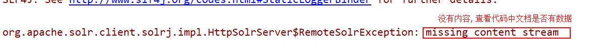

# 娱乐头条 -- 搜索引擎之solr

今日内容:

* solr的基本概念
* solr的部署 :
* solr的管理界面
* solr的配置文件:  3个
* solr的客户端工具 :  solrj
  * solrj完成对solr的索引库的CURD
  * solrj完成高级的内容:
    * 高亮
    * 排序
    * 分页


## 1. solr的基本概念


​	solr是一个企业级的搜索应用服务器, 如果想要连接solr需要通过发送http请求方法 , solr是基于lucene来来实现的

## 2. solr的部署

### 2.1 solr的下载

* 途径1: 官网网址: http://lucene.apache.org/  与Lucene的官网是一个
* 途径2: 下载历史版本的网址: http://archive.apache.org/dist/lucene/solr/
* 途径3: 使用资料中提供的即可(推荐)


### 2.2 solr的目录介绍

* solr的根目录


* example的目录


### 2.3 solr服务的启动

#### 2.3.1 solr的启动一: start.jar（了解）

启动步骤:

* 1) 打开cmd窗口
* 2) 切换目录到solr的example的目录下
* 3) 执行 java -jar start.jar


注意:  由于jar包已经内置了一个web服务器(jetty) , 其默认的访问的为8983

#### 2.3.2 solr的启动二:  solr.war

```
如果想要部署solr.war, 需要先准备一个tomcat, 建议准备一个全新的tomcat, 不要使用原来已经添加其他项目的tomcat, 将这个全新的tomcat放置在一个没有中文和空格的目录下, 建议放置在solr的目录下
```

需要保证: tomcat是可以正常启动的, 否则不要往下执行, 先解决tomcat的问题. 

​	一般出现的问题闪退的原因:  JAVA_HOME配置有问题  

启动步骤:

* 1) 首先打开example目录下的webapps目录下
* 2) 拷贝此目录下的solr.war , 将其复制到tomcat的webapps目录下


* 3) 启动tomcat, 将war包进行解压, 然后关闭tomcat并将war包删除或者更改后缀名即可
  * 将其原有war包更改的主要目的是防止再次解压, 导致原有的设置失效


* 4) 将资料中<<tomcat运行solr所需要的jar包>>复制到tomcat中solr的web-inf下的lib目录中 ,classes目录复制到web-inf下


* 5)将example中solr的目录建议复制到和tomcat同级的目录下(方便管理)
  * 复制后, 建议将这个索引库目录名称更改为solr-home


* 6) 打开tomcat的bin目录找到Catalina.bat文件, 将其右键打开
* 7) 将下列参数设置到此文件中即可
  * 参数 :   set "JAVA_OPTS=-Dsolr.solr.home=目录位置"  
  * 注意: 目录位置就是刚刚复制过来的solr的目录


* 8) 启动tomcat,访问localhost:8080/solr即可


## 3. solr的管理界面

* 仪表盘


* 日志窗口:  记录solr在启动过程中和启动后执行过程中的执行信息


解决警告信息:

​	第一步: 将solr的安装包中依赖包的两个目录, 复制到solr的索引库中


​	第二步: 打开索引库中的collection1中conf目录, 将solrconfig.xml右键打开, 去掉两个../即可


* core 窗口: 用于配置solr的索引库
  * solr中支持配置和管理多个索引库, 就像数据库中有多个database是一样的


如何配置多个索引库呢?

​	简单方案:  将collection1复制一个,然后删除其data文件夹并修改core.properties配置文件即可


* core selector: core的选择器, 用来针对不同core进行操作的


针对core selector的详细讲解:


### 3.1 使用solr的管理界面进行添加索引


### 3.2 使用solr的管理界面进行查询索引


> 在进行查询的时候, 都是使用代码的形式进行查询索引的, 然后展示给用户的系统, 而solr提供的管理界面, 主要是为了方便程序员对solr进行管理和测试的, 比如query: 在代码中编写查询的代码后, 我们并不知道查询后可能会展示什么内容, 或者并不知道展示的内容是否正确, 使用管理界面测试一下, 看一下结果和代码的结果是否一样

## 4. solr的配置文件

core.properties: 设置索引库的名称

### 4.1 solrConfig.xml : solr的核心配置文件(了解)

​	solrconfig.xml 配置文件主要定义了 solr 的一些处理规则，包括索引数据的存放 位置，更新，删除，查询的一些规则配置, solr相关的优化的时候, 需要使用这个配置文件。

​	一般此文件不需要进行修改, 采取默认即可

### 4.2 schema.xml: solr约束文件: 

​	Solr中会提前对文档中的字段进行定义，并且在schema.xml中对这些字段的属性进行约束，例如：字段数据类型、字段是否索引、是否存储、是否分词等等

```xml
<?xml version="1.0" encoding="UTF-8" ?>

<schema name="example" version="1.5">
  
   <!--  不能删除
   --> 
   <field name="_version_" type="long" indexed="true" stored="true"/>
   
   <field name="_root_" type="string" indexed="true" stored="false"/>

   <!-- 不删除
   --> 

	<!--
		field标签:  字段标签, 
			作用: 用来定义索引库中的字段的, 在solr中字段需要提前定义好, 而在lucene中手动定义的
			name :  字段的名称
			type :  字段的类型
			indexed :  是否(保存)分词
			stored  : 是否保存原始数据
			required :  是否必须存在
			multiValued  : 是否是多值的, 如果为true, 表示当前这个字段是一个数组
			
		id字段默认是必须存在的, 也就是说在创建document的时候, 在文档中必须要有id字段
			id表示的文档的唯一标识, 在solr中需要程序员自己进行维护, 在lucene中是由lucene自己维护的
	
	-->

   <field name="id" type="string" indexed="true" stored="true" required="true" multiValued="false" /> 
        
  
   <field name="name" type="string" indexed="true" stored="true"/>
 
   <field name="title" type="string" indexed="true" stored="true" multiValued="true"/>
  
   <field name="content" type="string" indexed="true" stored="true" multiValued="false"/>
   
   <field name="text" type="string" indexed="true" stored="false" multiValued="true"/>

  
   <!--
		dynamicField : 动态字段(动态域)
			作用 :  在solr中需要提前定义一些字段的, 但是不能够保证将所有的字段都提前的定义好,动态域中将可以帮助我们动态的生成一些字段
			
			假设, 在solr启动后, 想要使用docurl的字段, 但是这个字段并没有在schema文件中定义, 如果做?
				1) 将solr停机, 然后更改schema的文件, 添加一个新的字段
					但是服务器一般启动后, 是不允许随意的停机的
				2) 使用动态域字段 :  docurl_i		
   -->
   <dynamicField name="*_i"  type="int"    indexed="true"  stored="true"/>
   <dynamicField name="*_is" type="int"    indexed="true"  stored="true"  multiValued="true"/>
  
	<!--
	     uniqueKey : 表示的文档的唯一主键是那个字段 , 默认是id字段, 当然也可以进行修改
				设置的这个唯一的字段, 类型必须是string, 字段是必须存在的, 不能是多值
	-->
	<uniqueKey>id</uniqueKey>
	
	<!--
		copyField : 复制字段(复制域)	
			作用 :  主要是用于查询阶段使用的, 实现查询一个字段相当于查询多个字段
			source :  来源
 			dest   :  目的地
			
	    以下这两个标签描述的意思:
			将content 和 title字段中的索引数据复制一份出来, 放置到text的字段中, 这样当查询text字段的时候, 就相当于查询title和content
		复制域中目的地的字段必须是一个多值的字段
	-->
   <copyField source="content" dest="text"/>
   <copyField source="title" dest="text"/>
  
	<!--
		fieldType : 字段类型, 
			作用:  定义字段类型的
	-->
    <fieldType name="string" class="solr.StrField" sortMissingLast="true" />

    <fieldType name="boolean" class="solr.BoolField" sortMissingLast="true"/>

   
    <fieldType name="int" class="solr.TrieIntField" precisionStep="0" positionIncrementGap="0"/>
    <fieldType name="float" class="solr.TrieFloatField" precisionStep="0" positionIncrementGap="0"/>
    <fieldType name="long" class="solr.TrieLongField" precisionStep="0" positionIncrementGap="0"/>
    <fieldType name="double" class="solr.TrieDoubleField" precisionStep="0" positionIncrementGap="0"/>
 
    <fieldType name="date" class="solr.TrieDateField" precisionStep="0" positionIncrementGap="0"/>

</schema>
```

要求: 能够自己手动的添加字段即可, 能够根据需要添加一个复制域的标签

例如:  想要添加一个 docurl的字段, 这个字段的类型是string, 字段的需要进行分词的, 原始也需要保存, 不是一个多值的字段

例如: 娱乐头条中, 当查询新闻数据的时候, 一般需要根据那些字段来查询?

### 4.3  引入ik分词器

* 第一步: 导入ik相关的依赖包
  * 将三个文件放置在tomcat>webapps>solr>WEB-INF>lib下(此步骤在部署solr到tomcat中的时候, 就已经导入了)


* 第二步: 导入ik相关的配置文件(ik配置文件, 扩展词典和停止词典)
  * 将三个文件放置在tomcat>webapps>solr>WEB-INF>classes下(此步骤, 在部署solr到tomcat中的时候, 已经导入)


* 第三步, 在schema.xml配置文件中自定义一个字段类型, 引入ik分词器

```xml
 <fieldType name="text_ik" class="solr.TextField">
		<analyzer class="org.wltea.analyzer.lucene.IKAnalyzer"/>
 </fieldType>
```


* 第四步: 为对应的字段设置为text_ik类型即可


## 5. solr的客户端操作: solrj

​	solrj是Apache官方提供的一套java开发的, 用于操作solr服务的API, 通过这套API可以让java程序与solr服务进行交互, 让java程序可以直接操作solr服务进行增删改查

solrj的官网网址: https://wiki.apache.org/solr/Solrj

### 5.1 solr的基本入门程序

* 第一步: 导入相关的jar包

```xml
		<dependency>
			<groupId>org.apache.solr</groupId>
			<artifactId>solr-solrj</artifactId>
			<version>4.10.2</version>
		</dependency>
	<!--日志的包, solrj执行需要一个日志包-->
		<dependency>
			<groupId>commons-logging</groupId>
			<artifactId>commons-logging-api</artifactId>
			<version>1.1</version>
		</dependency>
```

* 编写入门程序(写入索引)

```java
// 写入索引的入门代码(原生写入)
    @Test
    public void indexWriterTest01() throws  Exception{

        //1. 创建solrj连接solr的远程服务对象 : #表示的页面的路径 不带#号才是访问的接口路径
        SolrServer solrServer = new HttpSolrServer("http://localhost:8080/solr/collection1");
        //2. 添加文档数据
        SolrInputDocument doc = new SolrInputDocument();
        doc.addField("id",1);
        doc.addField("title","连休三天！端午节放假通知来了");
        doc.addField("content","请广大市民提前安排好工作生活，节日期间注意安全，度过一个平安、祥和的节日假期。");

        solrServer.add(doc);

        //3. 提交数据
        solrServer.commit();


    }
```

### 5.2 solrj写入索引(写入多条索引)

在进行写入索引的时候, 字段的值的类型可以和solr中的类型不一致, solr服务器会自动的进行转换成指定类型, 但是如果无法转换, 就会报错的

```java
// 一次性写入多条数据
    @Test
    public void indexWriterTest02() throws  Exception{
        //1. 创建solrj连接solr的服务对象
        SolrServer solrServer = new HttpSolrServer("http://localhost:8080/solr/collection1");

        //2. 添加文档数据
        List<SolrInputDocument> docs = new ArrayList<SolrInputDocument>();

        for(int i = 2 ; i<=7 ; i++){
            SolrInputDocument doc = new SolrInputDocument();
            doc.addField("id",i);
            doc.addField("title","solr的简介 " + i);
            doc.addField("content","solr是apache官方提供企业级的搜索应用服务器, 连接solr需要发送http请求, solr的底层是lucene " +i);

            docs.add(doc);
        }

        solrServer.add(docs);

        //3. 提交数据
        solrServer.commit();
    }

```


### 5.3 使用solrj写入索引(使用javabean进行写入)

一个标准的javaBean都具备什么条件?

* 1) 成员属性必须私有化
* 2) 必须为成员属性提供get 和 set方法
* 3) 必须提供无参的构造方法
* 4)  必须要实现序列化接口: 只要实现可这个接口, 那么这个对象支持网络io操作及持久化到磁盘的操作

pojo类:

```
public class News implements Serializable {
    private String id;
    private String title;
    private String content;
    private String docurl;
   //  省略了 get  和  set方法  和 toString的方法
}
```

* 代码的实现

```java
// 直接写入一个javaBean对象
    @Test
    public void indexWriterTest03() throws  Exception {

        //1. 创建solrj连接solr的服务对象
        SolrServer solrServer = new HttpSolrServer("http://localhost:8080/solr/collection1");

        //2. 添加文档数据
        News news = new News("8","国务院定了！11月底前在全国全面实施“携号转网”","国务院总理李克强5月14日主持召开国务院常务会议，部署进一步推动网络提速降费，发挥扩内需稳就业惠民生多重效应","http://baijiahao.baidu.com/s?id=1633615346318630206");


        solrServer.addBean(news);

        //3. 提交数据
        solrServer.commit();
    }
```


```
出现错误的原因: solr并不知道在pojo中那个字段是solr的字段, 所以solr报错显示没有定义字段错误
	解决方案: 告诉solr那个是你的字段
		添加一个字段的注解即可 :  @Field
如果字段的值 和 solr中字段不匹配, 可以在注解后面添加指定的字段值, 标识将pojo中属性放置到这个字段中
```


### 5.4 删除索引

修改索引: 只要保证id一致, 就是修改索引的操作

```java
// 删除索引
    @Test
    public void delIndexTest04() throws  Exception{
        //1. 创建solrj连接solr的而服务对象
        SolrServer solrServer = new HttpSolrServer("http://localhost:8080/solr/collection1");

        //2. 添加删除的条件
        //solrServer.deleteById("change.me");  根据id删除
        //solrServer.deleteByQuery("*:*"); //删除所有
        solrServer.deleteByQuery("id:1"); //删除所有
        //3. 执行删除

        solrServer.commit();
    }
```

### 5.5 查询操作

#### 5.5.1 查询入门代码(原始)

```java
    // 1) 查询索引的入门代码(原生)
    @Test
    public void indexSearcherTest01() throws  Exception{
        //1. 创建solrj连接solr的服务对象
        SolrServer solrServer = new HttpSolrServer("http://localhost:8080/solr/collection1");

        //2. 封装查询的条件
        SolrQuery query = new SolrQuery("*:*");

        //3. 执行查询
        QueryResponse response = solrServer.query(query);
        //4. 获取数据
        SolrDocumentList documentList = response.getResults();

        for (SolrDocument document : documentList) {
            String id = (String) document.get("id");
            String content = (String) document.get("content");
            ArrayList<String> title = (ArrayList<String> ) document.get("title");
            String docurl_i = (String) document.get("docurl_i");

            System.out.println(id+"  "+title+"   "+content+"  "+ docurl_i);

        }

    }
```

#### 5.5.2 返回javaBean

```java
//2.  查询索引, 返回javaBean对象
    @Test
    public void indexSearcherTest02() throws  Exception{
        //1. 创建solrj 连接solr的服务对象
        SolrServer solrServer  =  new HttpSolrServer("http://localhost:8080/solr/collection1");

        //2. 封装查询条件
        SolrQuery solrQuery = new SolrQuery("*:*");

        //3. 执行查询
        QueryResponse response = solrServer.query(solrQuery);

        //4. 获取数据  : 采用的第三种方式来解决数据无法转换的问题
        ArrayList<News> newsArrayList = new ArrayList<News>();
        SolrDocumentList documentList = response.getResults();
        for (SolrDocument document : documentList) {
            News news = new News();

            String id = (String) document.get("id");
            news.setId(id);
            String content = (String) document.get("content");
            news.setContent(content);
            ArrayList<String> title = (ArrayList<String> ) document.get("title");
            news.setTitle(title.get(0));
            String docurl_i = (String) document.get("docurl_i");
            news.setDocurl(docurl_i);

            newsArrayList.add(news);
        }

        System.out.println(newsArrayList);

    }
```


```
原因: 不能将一个集合类型的数据转换成一个字符串

解决方案:
	1) schema.xml中配置信息: 将多值的字段更改为单值字段
		注意: 一旦将约束文件修改了, 建议将数据全部清空, 重新添加, 所以在添加数据之前, 一定要确认配置文件是没有问题的
	2) 将javaBean中指定的字段更改为对应的类型即可
	3) 手动人为封装即可(推荐使用)
```


#### 5.5.2 复杂查询

* 抽取一个公共的查询的方法

```java
// 抽取一个公共的查询的方法
    public  void publicQuery(SolrQuery query) throws  Exception{

        //1. 创建 solrj连接solr的服务对象
        SolrServer solrServer  = new HttpSolrServer("http://localhost:8080/solr/collection1");

        //2. 封装查询的条件

        //3. 执行查询

        QueryResponse response = solrServer.query(query);


        //4. 获取数据
        List<News> newsList = response.getBeans(News.class);

        for (News news : newsList) {
            System.out.println(news);
        }

    }
```

在创建SolrQuery时，我们填写的Query语句，可以有以下高级写法：

查询语句中如果有特殊字符，需要转义，可以使用：  ” ”

1、匹配所有文档：\*:\* （通配符？和 \* ：“*”表示匹配任意字符；“?”表示匹配出现的位置）

2、布尔操作：AND、OR和NOT布尔操作（推荐使用大写，区分普通字段）

3、子表达式查询（子查询）：可以使用“()”构造子查询。 比如：(query1 AND query2) OR (query3 AND query4)

4、相似度查询：

（1）默认相似度查询：title:appla~，此时默认编辑距离是2

（2）指定编辑距离的相似度查询：对模糊查询可以设置编辑距离，可选0~2的整数：title:appla~1。

5、范围查询（Range Query）：solre支持对数字、日期甚至文本的范围查询，并且两端范围。结束的范围可以使用“*”通配符。

（1）日期范围（ISO-8601 时间GMT）：birthday:[1990-01-01T00:00:00.000Z TO 1999-12-31T24:59:99.999Z]

（2）数字：age:[2000 TO *] 

（3）文本：content:[a TO a]

```java
// 复杂查询:

    @Test
    public void complexQueryTest() throws Exception {
        //1.  通配符查询 :  *   ?
        // SolrQuery query = new SolrQuery("content:luce*");

        //2. 相似度查询   和 lucene的模糊查询    最大编辑次数 2次
        // 可以在~的后面修改最大的编辑次数范围 0~2 , 如果编写的范围不是这个范围之内的数字, 那么solr修改为默认值 2
        // SolrQuery query = new SolrQuery("content:lucene~");

        //3. 范围查询 :    对 数字, 文本, 日期进行范围查询
        // 格式 :  字段名称 :  [min TO MAX]

        // 根据id查询, 是文本范围呢?  还是数字范围 ?     是文本范围, 因为id类似是字符串
        // 文本范围:  按照字典的顺序进行排列
        // 字典顺序 :   1 2 3 4 5 6 7 8  9 10  11 12  13   22  33  44  55
        //      按照字典顺序:从小到大  1 10 11 12 13  2 22  3 33 4 44  5  55  6 7 8  9
        //  例如: 手机通信录, 微信通信录

        // 日期范围:  在solr中对于日期的格式是有明确规定的, 在solr中采用日期的格式为国际通用时间UTC(国际协调时间)格式
        //  UTC格式 :  yyyy-MM-dd'T'HH:mm:ss'Z'
        //  国际时间 和 中国时间  是有时间差 :  8个小时, 中国属于东八区  和大于国际时间八个小时
        // 所以当向solr中存储一个日期类型的值:  日期的时间差的问题, 建议转换成国内时间
        //  如果拿到的时候, 本身就是国内时间值, 采用字符串的形式写入到solr的索引库, 那么solr索引库不会将其-8小时的

       //  SolrQuery query = new SolrQuery("id:[1 TO 5]");

        //4.  布尔操作  和  lucene中BooleanQuery 是类似的
        /**  SOLR      LUCENE
         *   AND       MUST
         *   NOT       MUST_NOT
         *   OR        SHOULD
         */
        // 5 子表达式 :  布尔查询中派生出来查询的方式  id:[2 TO 5] AND (content:lucene OR title:5)
        SolrQuery query = new SolrQuery("id:[2 TO 5] AND (content:lucene OR title:5) NOT content:3");  // 5 2 3 4 7

        publicQuery(query);
    } 
```

> SolrQuery :  将这个对象可以看做是整个搜索的界面对象
>
> ​	所以整个查询的界面中所有的参数都可以通过SolrQuery来封装查询处理
>
> ​	支持复杂的查询方式 


## 6. solr的高级

### 6.1 solr的高亮

```java
// solr的高亮
    @Test
    public void highlighterTest01() throws  Exception{
        //1. 创建solrj连接solr的服务对象
        SolrServer solrServer = new HttpSolrServer("http://localhost:8080/solr/collection1");

        //2. 封装查询的条件 : SolrQuery
        SolrQuery solrQuery = new SolrQuery("content:solr是apache节日期间");
        //2.1 高亮的参数
        solrQuery.setHighlight(true); //开启高亮
        solrQuery.addHighlightField("title");
        solrQuery.addHighlightField("content");
        solrQuery.setHighlightSimplePre("<font color='red'>");
        solrQuery.setHighlightSimplePost("</font>");

        //3. 执行查询
        QueryResponse response = solrServer.query(solrQuery);

        //4. 获取数据
        List<News> newsList = response.getBeans(News.class);


        //5. 获取高亮
        // 最外层的MAP:  KEY  高亮的文档的id值
        //  内层的map : key  表示的高亮的字段
        //   list集合:  存储对应高亮字段的高亮的内容, 一般来说list集合中只有一个值
        Map<String, Map<String, List<String>>> highlighting = response.getHighlighting();

        for (News news : newsList) {

            String id = news.getId();
            Map<String, List<String>> listMap = highlighting.get(id);
            List<String> list = listMap.get("title");
            if(list != null  && list.size()>0){
                // 表示有title的高亮
                news.setTitle(list.get(0));
            }

            list = listMap.get("content");
            if(list != null  && list.size()>0){
                // 表示有title的高亮
                news.setContent(list.get(0));
            }

            System.out.println(news);
        }


    }
```

### 6.2 solr的排序

```java
@Test
    public void sortTest02() throws  Exception{
        //1. 创建solrj连接solr的服务对象
        SolrServer solrServer = new HttpSolrServer("http://localhost:8080/solr/collection1");

        //2. 封装查询的条件 : SolrQuery
        SolrQuery solrQuery = new SolrQuery("content:solr是apache节日期间");
        //2.1 高亮的参数
        solrQuery.setHighlight(true); //开启高亮
        solrQuery.addHighlightField("title");
        solrQuery.addHighlightField("content");
        solrQuery.setHighlightSimplePre("<font color='red'>");
        solrQuery.setHighlightSimplePost("</font>");

        //2.2  添加排序的条件
        solrQuery.setSort("id", SolrQuery.ORDER.asc);
        //3. 执行查询
        QueryResponse response = solrServer.query(solrQuery);

        //4. 获取数据
        List<News> newsList = response.getBeans(News.class);


        //5. 获取高亮
        // 最外层的MAP:  KEY  高亮的文档的id值
        //  内层的map : key  表示的高亮的字段
        //   list集合:  存储对应高亮字段的高亮的内容, 一般来说list集合中只有一个值
        Map<String, Map<String, List<String>>> highlighting = response.getHighlighting();

        for (News news : newsList) {

            String id = news.getId();
            Map<String, List<String>> listMap = highlighting.get(id);
            List<String> list = listMap.get("title");
            if(list != null  && list.size()>0){
                // 表示有title的高亮
                news.setTitle(list.get(0));
            }

            list = listMap.get("content");
            if(list != null  && list.size()>0){
                // 表示有title的高亮
                news.setContent(list.get(0));
            }

            System.out.println(news);
        }


    }
```

### 6.3 solr的分页

```java
// 分页
    @Test
    public void pageTest03() throws  Exception{
        int page = 3; //当前页
        int pageSize = 2; // 每页的条数

        //1. 创建solrj连接solr的服务对象
        SolrServer solrServer = new HttpSolrServer("http://localhost:8080/solr/collection1");

        //2. 封装查询的条件 : SolrQuery
        SolrQuery solrQuery = new SolrQuery("content:solr是apache节日期间");
        //2.1 高亮的参数
        solrQuery.setHighlight(true); //开启高亮
        solrQuery.addHighlightField("title");
        solrQuery.addHighlightField("content");
        solrQuery.setHighlightSimplePre("<font color='red'>");
        solrQuery.setHighlightSimplePost("</font>");

        //2.2  添加排序的条件
        solrQuery.setSort("id", SolrQuery.ORDER.asc);

        //2.3 封装分页的条件
        solrQuery.setStart( (page-1)*pageSize );
        solrQuery.setRows(pageSize);

        //3. 执行查询
        QueryResponse response = solrServer.query(solrQuery);

        //4. 获取数据
        List<News> newsList = response.getBeans(News.class);


        //5. 获取高亮
        // 最外层的MAP:  KEY  高亮的文档的id值
        //  内层的map : key  表示的高亮的字段
        //   list集合:  存储对应高亮字段的高亮的内容, 一般来说list集合中只有一个值
        Map<String, Map<String, List<String>>> highlighting = response.getHighlighting();

        for (News news : newsList) {

            String id = news.getId();
            Map<String, List<String>> listMap = highlighting.get(id);
            List<String> list = listMap.get("title");
            if(list != null  && list.size()>0){
                // 表示有title的高亮
                news.setTitle(list.get(0));
            }

            list = listMap.get("content");
            if(list != null  && list.size()>0){
                // 表示有title的高亮
                news.setContent(list.get(0));
            }

            System.out.println(news);
        }


    }
```


总结: 

* 1) solr的基本概念:  solr是apache官方提供的一个企业级的全文搜索应用服务器, 连接solr服务器需要发送http请求, solr的底层是lucene
* 2) solr的部署 :
  * 2.1) solr的下载 : 1) 通过官网(只能下载最新版本) 2) 下载历史的版本 3) 使用资料提供好的
  * 2.2) solr的目录的结构 : 
  * 2.3) solr的部署:  
    * 2.3.1)  一种采用start.jar 的方式部署(最简单的方式),内置了jetty的服务器(8983)
    * 2.3.2) 采用 solr.war方式进行部署(步骤比较多), 部署在tomcat中  (需要参考文档部署成功)
* 3) solr的管理界面 :  会操作即可
  * 3.1) 检测某一个字段的分词效果
  * 3.2) 使用管理界面能够添加索引和修改索引
  * 3.3) 使用管理界面可以查询索引数据
  * 3.4) 查看某一个字段在索引库中分词内容

* 4) solr的配置文件 :
  * 4.1) core.properties:  配置索引库的名称
  * 4.2) solrConfig.xml:  对solr的服务器进行相关的配置
  * 4.3) **schema.xml** : 对solr的索引库进行相关的配置
* 5) solr的客户端操作:solrj的操作   -------会操作, 尽可能不用查看文档内容
  * 使用solrj完成 对solr索引库的CURD操作
  * 使用solrj完成对solr高级的操作: 高亮, 排序, 分页


常见错误:

