# 娱乐头条_search_solrCLoud

今日内容:

* solrCloud :  solr的集群
  * 什么是solrCLoud:  什么时候需要使用solrCloud
  * solrCloud的结构 :
  * solrCloud集群的数据的读取和分裂的流程
* solrCloud的部署 :   能够参考文档搭建成功
  * zookeeper集群
  * solrCLoud的集群
* solrCloud的管理命令 :   将其记录好, 用的时候打开复制
* 使用solrj完成对solrCloud的操作 : 会操作
* dubbox:
  * 为什么要使用dubbox, 基本概念  :  理解
  * dubbox基本使用  :  dubbox的功能的体验

## 1. solrCloud基本概念

### 1.1 什么是solrCloud

​	SolrCloud(solr 云)是Solr提供的分布式搜索方案，当你需要大规模，容错，分布式索引和检索能力时使用 SolrCloud。当一个系统的索引数据量少的时候是不需要使用SolrCloud，当**索引量很大**，**搜索请求并发很高**，这时需要使用SolrCloud来满足这些需求。

### 1.2 solrCloud的结构

​	SolrCloud为了降低单机的处理压力，需要由多台服务器共同来完成索引和搜索任务。实现的思路是将索引数据进行Shard（分片）拆分，每个分片由多台的服务器共同完成，当一个索引或搜索请求过来时会分别从不同的Shard的服务器中操作索引。

​	SolrCloud需要Solr基于Zookeeper部署，Zookeeper是一个集群管理软件，由于SolrCloud需要由多台服务器组成，由zookeeper来进行协调管理。


下图是一个SolrCloud应用的例子：

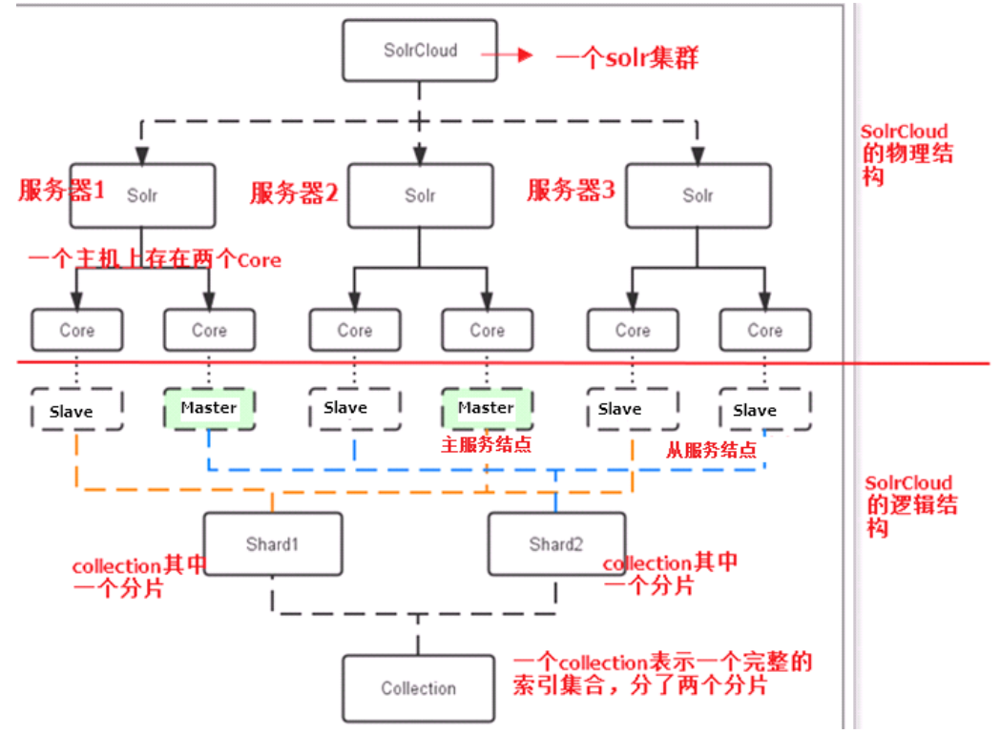

- 物理结构:
  - 指定就是三台solr服务器(直白一点就是三个部署了solr的tomcat)
    - 每个tomcat中都有两个core(索引库)
- 逻辑结构
  - 我们把整个集群看做了一个整体(一个大的索引库), 在这个索引库下有两个分片(也就是把索引库分成两部分), 每一个分片都有三个节点(对应就是物理结果中各个tomcat的索引库),其中一个为主节点,两个备份节点

整体部署的结构图:

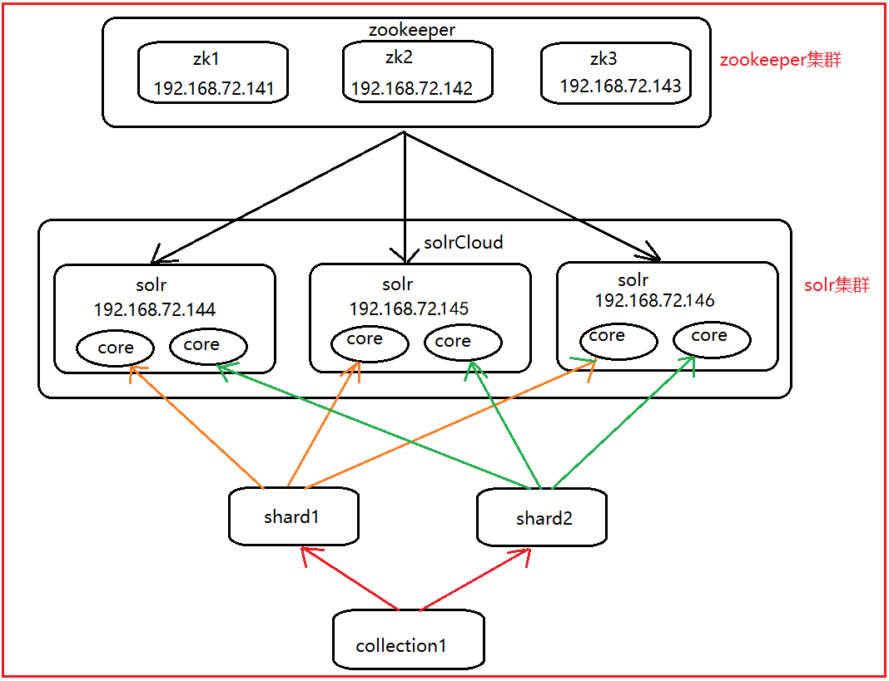

### 1.3 solr集群中数据的读取及分裂流程(了解)

* 写数据的流程

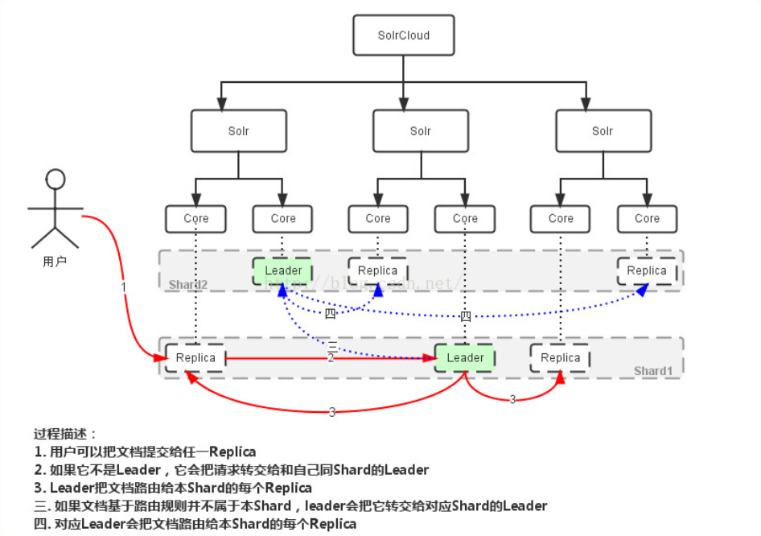

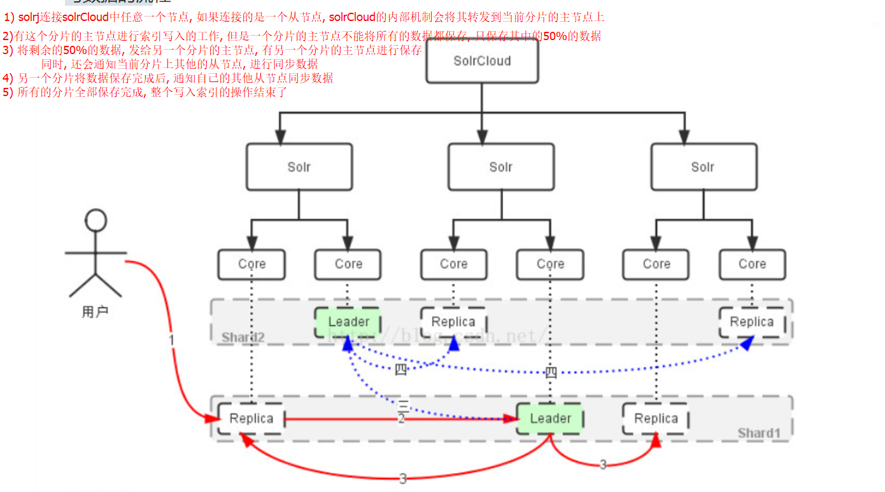

> 写入的流程中: 写入索引的节点是每个分片的主节点
>
> 请问: 如果能够让分片中数据保存均衡呢? 
>
> ​	1) 你一下我一下
>
> ​	2) hash取模计算法 :  先对数据进行hash取值, 得到一个int类型的hash值, 除于当前分片的数量, 对其取余:  0~分片的数量-1 ,  得到那个结果,  将其保存在对应编号的分片中即可
>
> ​	随着数量量越大, 均匀分配越好

* 读数据

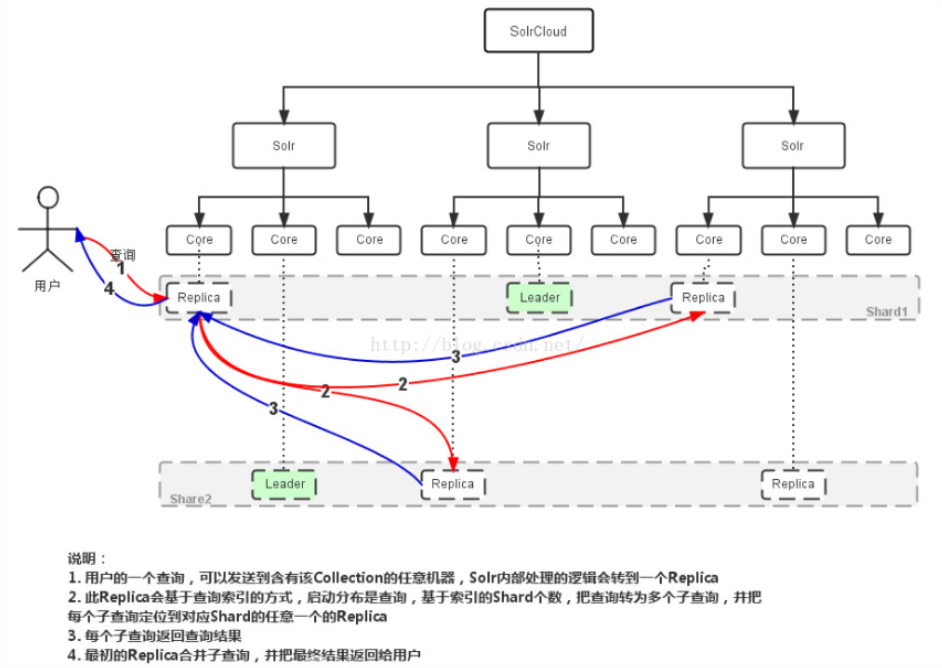

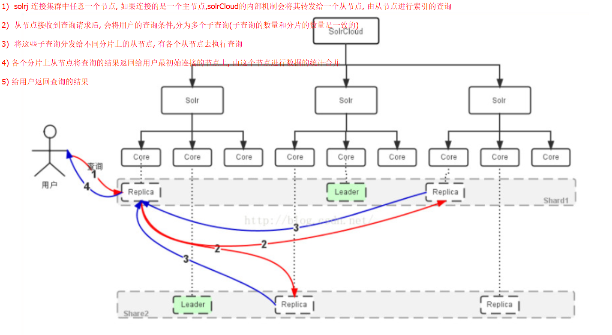

> 读数据过程, 不需要master程序参与的, 由slave节点完成读的操作
>
> 在solrCloud中, 读写是分离的

* 副本分裂

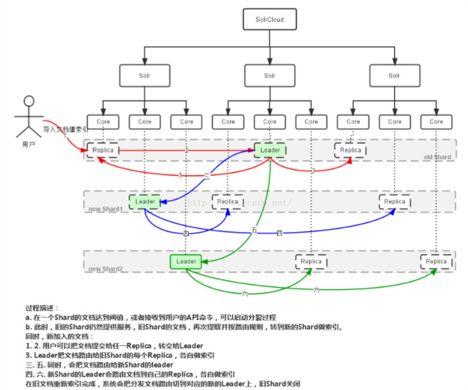

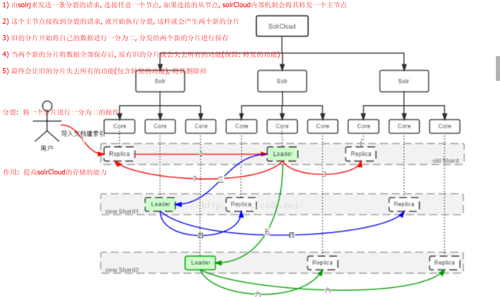

> 如果想要删除一个分片, 必须要将这个分片进行分裂, 因为如果不分裂, 那么这个分片中是有整个索引库中一部分的数据的, 不允许删除

## 2. zookeeper

​	ZooKeeper是一个分布式的，开放源码（apache）的分布式应用程序协调服务，是Google的Chubby一个开源的实现，**是Hadoop和Hbase、dubbox、kafka的重要组件**。它是一个为分布式应用提供一致性服务的软件，提供的功能包括:配置维护、域名服务、分布式同步、组服务等。**zookeeper管理工具,管理集群和分布式项目**

* **zookeeper在solrCloud中的作用**
  * 主要用来管理solr集群中的相关配置信息和集群的运行状态, 协助solr进行主节点的选举

准备工作

​	三台虚拟机: 安装好 jdk1.8 64位即可

```
vi /etc/hosts
添加如下内容:
192.168.72.141 node01
192.168.72.142 node02
192.168.72.143 node03
注意: 添加时, 前面ip地址一定是自己的三台linux的ip地址 切记不要搞错了
```

## 3. zookeeper集群搭建

### 3.1  上传zookeeper的压缩包(上传其中一台141即可)

```
cd /export/software/
rz          //此时选择zookeeper的压缩包进行上传
```

### 3.2 解压zookeeper到指定的目录

```
tar -zxf zookeeper-3.4.9.tar.gz -C /export/servers/
cd /export/servers/
```

### 3.3 修改zookeeper的配置文件

```
cd /export/servers/zookeeper-3.4.9/conf
mv zoo_sample.cfg  zoo.cfg
vi zoo.cfg
```

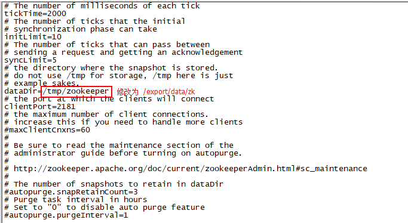

```
修改后, 在配置文件的底部, 添加如下内容
server.1=node01:2887:3887
server.2=node02:2887:3887
server.3=node03:2887:3887

更改后配置文件整体内容如下:(如果担心修改错误, 可以直接将zoo.cfg中的内容全部删除, 复制以下内容即可)

# The number of milliseconds of each tick
tickTime=2000
# The number of ticks that the initial
# synchronization phase can take
initLimit=10
# The number of ticks that can pass between
# sending a request and getting an acknowledgement
syncLimit=5
# the directory where the snapshot is stored.
# do not use /tmp for storage, /tmp here is just
# example sakes.
dataDir=/export/data/zk
# the port at which the clients will connect
clientPort=2181
# the maximum number of client connections.
# increase this if you need to handle more clients
#maxClientCnxns=60
#
# Be sure to read the maintenance section of the
# administrator guide before turning on autopurge.
#
# http://zookeeper.apache.org/doc/current/zookeeperAdmin.html#sc_maintenance
#
# The number of snapshots to retain in dataDir
#autopurge.snapRetainCount=3
# Purge task interval in hours
# Set to "0" to disable auto purge feature
#autopurge.purgeInterval=1

#zookeeper集群配置
server.1=node01:2887:3887
server.2=node02:2887:3887
server.3=node03:2887:3887
```

\*\*** **处理完成后保存退出即可**

### 3.4 将配置好的zookeeper发送到其他两台主机上

```
cd /export/servers/
scp -r zookeeper-3.4.9/ root@node02:$PWD   //将zookeeper复制到node02的同级目录下
scp -r zookeeper-3.4.9/ root@node03:$PWD   //将zookeeper复制到node03的同级目录下
```

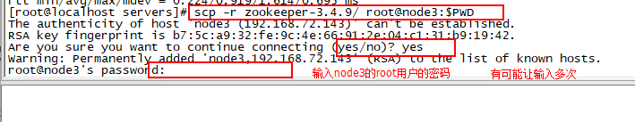

```
发送完成后,在其他两台主机查看, 是否已经成功接收到
cd /export/servers
ll
```

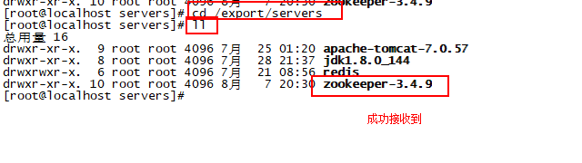

### 3.5 分别在三台主机输入如下命令

> 注意: 在执行下列的命令的时候, 一定要看准了, 那一台是server.1,就在那一台写1

```
node01:执行的命令
mkdir -p  /export/data/zk
echo "1" > /export/data/zk/myid 
cat /export/data/zk/myid             //此命令用于查看此文件有没有正确写入 1

node02:执行的命令
mkdir -p  /export/data/zk
echo "2" > /export/data/zk/myid 
cat /export/data/zk/myid             //此命令用于查看此文件有没有正确写入 2

node03:执行的命令
mkdir -p  /export/data/zk
echo "3" > /export/data/zk/myid 
cat /export/data/zk/myid            //此命令用于查看此文件有没有正确写入 3
```

### 3.6 分别启动三台zookeeper(建议启动顺序 node1>>node2>>node3 依次启动)

```
# 每一台都得进行启动: 一下每一台执行的命令
cd /export/servers/zookeeper-3.4.9/bin/
./zkServer.sh start
```

* node01: follower

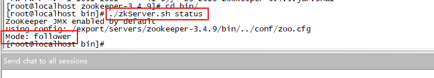

* node02:  为leader

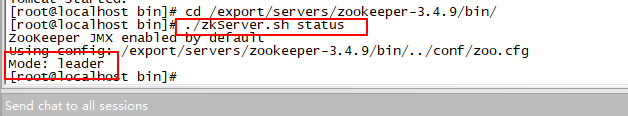

* node03: follower

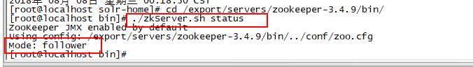

### 3.7 zookeeper的选举机制(了解)

* 初始化集群: 采取投票机制, 选举过半即为leader

```
1. 当第一台(id=1),启动后, 由于目前自有自己,故会把票投给自己
2. 当第二台(id=2),启动后, 由于目前已经又二台启动, 这时候会将票投给id最大的机器, 此时三台中已经有二台启动, 数量过半, 第二台理所应当的成为了leader
3. 当第三台(id=3),启动后, 虽然id=3为最大, 但是由于leader已经产生, 故只能担任follower
```

* 当下一次在重新启动时, 又会恢复选举,此时谁的数据多, 谁为leader, 如果数据都一样, 那么看id谁最大,同时一般选举过半,就会产生leader

## 4. solrCloud搭建

> 准备工作:  需要将原有在Windows中的solr的服务器移植到linux中运行, 在移植之前, 需要将本地的solr服务器中schema文件替换成资料中提供的schema文件

务必要进行替换, 否则后续内容将无法进行....

> 在替换的时候, 只需要将collection1中的schema进行替换即可

### 4.1 将在window中部署的单机版solr上传到node01中

```
cd /export/software/
rz               //选择资料中的solr.zip进行上传(此zip就是solr当天部署后的内容,包含solr-home和tomcat)
```

### 4.2 将zip进行解压到指定目录中

```
yum -y install unzip
cd /export/software/
unzip solr.zip 
mv solr /export/servers/
```

### 4.3 修改tomcat的Catalina.sh的配置文件

```
cd /export/servers/solr/apache-tomcat-8.5.31/bin
vi catalina.sh             //注意此时修改的.sh的文件 并非.bat

添加如下内容:(此处后期还会进行修改, 目前只是为了测试单机版本能否在linux中运行)
export "JAVA_OPTS=-Dsolr.solr.home=/export/servers/solr/solr-home"
```

\*\**\*\*  **添加后保存退出即可**

### 4.4 启动tomcat测试单机版本能否在linux中运行

```
注意: 由于是解压的是zip文件, tomcat中的.sh文件都没有任何的执行缺陷, 需要进行赋权限:
chmod 755 /export/servers/solr/apache-tomcat-8.5.31/bin/*.sh

启动tomcat:
cd /export/servers/solr/apache-tomcat-8.5.31/bin/
./startup.sh 
```

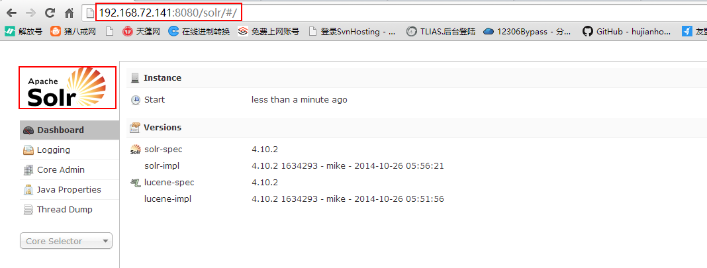

\**\*\* **看到此页面,说明单机版本配置成功**

```
成功后:将tomcat务必关机操作
./shutdown.sh 
```

\**\*\* **务必执行以上命令, 关闭tomcat** (出现了403这个错误, 那么说明, 当时tomcat忘记关闭了)

### 4.5 将solr-home中的data目录全部清空, 并且只保留一个索引库即可

```
 cd /export/servers/solr/solr-home/
 rm -rf collection2/                    //删除多余的索引库, 只保留一个collection1即可
 rm -rf collection1/data/
```

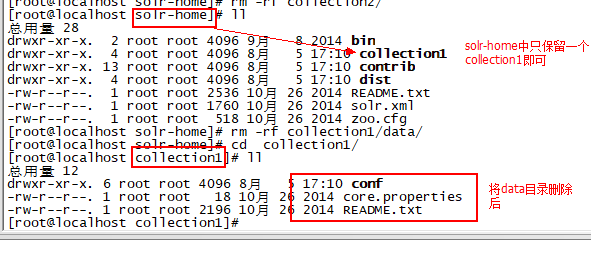

### 4.6 将solr的配置文件交给zookeeper进行管理

> solr已经提供了将配置文件提交给zookeeper的命令了, 这个上传配置文件的命令就在solr的安装包中

```
1. 需要先上传solr的安装包
 cd /export/software/
 rz
2. 解压solr的安装包
	unzip solr-4.10.2.zip 
3. 将solr安装包复制到/export/servers下
	mv solr-4.10.2 /export/servers/
4. 开始执行上传
	cd /export/servers/solr-4.10.2/example/scripts/cloud-scripts/
	//注意: 以下命令是一行
	./zkcli.sh -zkhost node01:2181,node02:2181,node03:2181 -cmd upconfig -confdir /export/servers/solr/solr-home/collection1/conf/ -confname solrconf
```

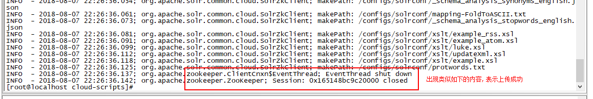

```
以下命令主要用于查看zookeeper中是否存在solr的配置文件: 可以不执行跳过
cd /export/servers/zookeeper-3.4.9/bin
./zkCli.sh
ls /configs/solrconf
```

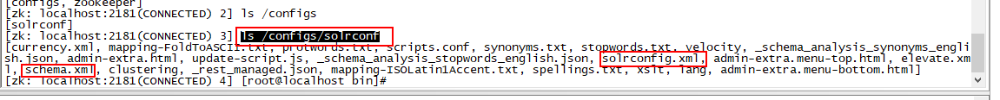

### 4.7 修改solr.xml配置文件

solr.xml是solr集群管理文件

```
cd /export/servers/solr/solr-home/
vi solr.xml
```

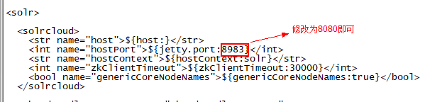

### 4.8 修改tomcat的Catalina.sh配置文件

```
cd /export/servers/solr/apache-tomcat-7.0.77/bin/
vi catalina.sh 
*** 修改如下内容
export "JAVA_OPTS=-Dsolr.solr.home=/export/servers/solr/solr-home   //原来的内容

//以下为替换后的内容  注意: 这是一行内容, 复制时一起复制即可
export "JAVA_OPTS=-Dsolr.solr.home=/export/servers/solr/solr-home -DzkHost=node01:2181,node02:2181,node03:2181"      
```

### 4.9 将solr目录发送到其他两台linux上(node02,node03)

```
cd /export/servers/
scp -r solr root@node02:$PWD
scp -r solr root@node03:$PWD
```

在其他两台主机上查看, 是否接收成功:

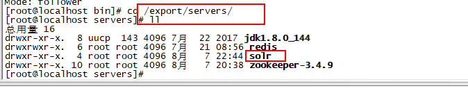

### 4.10 依次启动三台solr即可

```
cd /export/servers/solr/apache-tomcat-7.0.77/bin/
./startup.sh
```

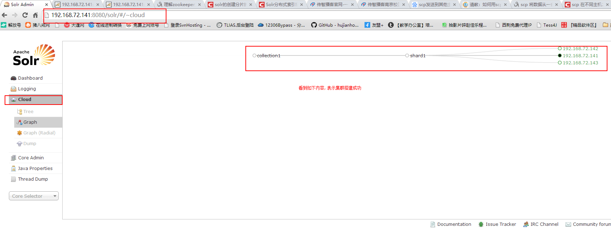


### 4.11 自动化脚本编写与启动

一共需要四个shell脚本:

```
1)  启动 和 关闭  zookeeper集群的脚本   (2个)
2)  启动 和 关闭  solrCloud集群的脚本   (2个)
```

* 1) zookeeper集群的启动和关闭脚本
  * 脚本的放置位置: /export/servers/zookeeper-3.4.9/bin

```shell
zookeeper的关闭脚本 :  shutdownZKCloud.sh
脚本内容如下: 
#!/bin/sh
echo "关闭zookeeper中...."
for host in node01 node02 node03
do
	ssh -q $host "source /etc/profile; /export/servers/zookeeper-3.4.9/bin/zkServer.sh stop"
done
echo "关闭zookeeper完成..."


zookeeper的启动脚本 :  startZKCloud.sh
脚本内容如下: 
#!/bin/sh
echo "启动zookeeper中...."
for host in node01 node02 node03
do
	ssh -q $host "source /etc/profile; /export/servers/zookeeper-3.4.9/bin/zkServer.sh start"
done
echo "启动zookeeper完成..."
```

* 2) solrCloud的启动和关闭脚本
  * 脚本的放置位置: /export/servers/solr/bin

```shell
solrCloud的关闭脚本: shutdownSolrCloud.sh
脚本内容如下:
#!/bin/sh
echo "关闭solrCloud中..."
for host in node01 node02 node03
do
	ssh -q $host "source /etc/profile; /export/servers/solr/apache-tomcat-8.5.31/bin/shutdown.sh"
done
echo "关闭solrCloud完成..."

solrCloud的启动的脚本 :  startSolrCloud.sh
脚本内容如下: 
#!/bin/sh
echo "启动solrCloud中..."
for host in node01 node02 node03
do
	ssh -q $host "source /etc/profile; /export/servers/solr/apache-tomcat-8.5.31/bin/startup.sh"
done

echo "solrCloud启动完成....."
```

* 3)  为四个脚本赋权限

```shell
chmod 755 /export/servers/zookeeper-3.4.9/bin/shutdownZKCloud.sh
chmod 755 /export/servers/zookeeper-3.4.9/bin/startZKCloud.sh
chmod 755 /export/servers/solr/bin/shutdownSolrCloud.sh
chmod 755 /export/servers/solr/bin/startSolrCloud.sh
```

* 4) 启动各个脚本即可
  * 在启动的时候需要先启动zookeeper集群, 后启动solr集群, 
  * 在关闭的时候需要先关闭solr集群后关闭zookeeper集群


## 5. solrCloud相关的管理命令

### 5.1 创建新集群(创建一个索引库)

```
http://192.168.72.141:8080/solr/admin/collections?action=CREATE&name=collection2&numShards=2&replicationFactor=3&maxShardsPerNode=8&property.schema=schema.xml&property.config=solrconfig.xml


接口参数说明:

action: 表示执行的操作 CREATE 创建
name: 新集群的名称
numShards: 分片数
replicationFactor: 每个分片的节点数
maxShardsPerNode: 设置每个分片的最大节点数, 默认为1
property.schema: 指定使用的schema文件   (注意, 此文件必须在zookeeper上存在)
property.config: 指定使用的solrConfig文件 (注意, 此文件必须在zookeeper上存在)

```

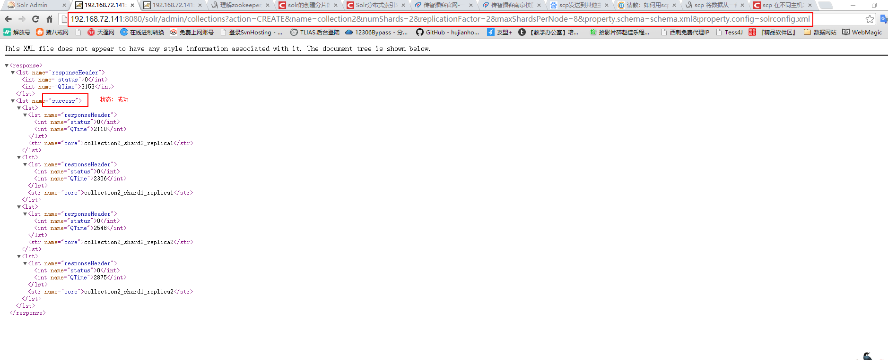

### 5.2 删除core命令

> 会将真实的索引库的数据删除, 这个命令慎用

```
http://192.168.72.141:8080/solr/admin/collections?action=DELETE&name=collection1
```

### 5.3 查询所有的Core

```
http://192.168.72.141:8080/solr/admin/collections?action=LIST
```

### 5.4 显示core的状态

```
http://192.168.72.141:8080/solr/admin/collections?action=clusterstatus
```

### 5.5 分裂shard(扩展容量)

分裂: 就是将某个分片分成两个分片

​	注意: 一旦分裂后, 虽然原来的分片还可以提供服务, 但是已经不再保存数据, 会将数据保存到新的分裂后的分片

```
http://192.168.72.141:8080/solr/admin/collections?action=SPLITSHARD&collection=collection2&shard=shard1

参数说明:
shard: 指定要分裂的分片
```

### 5.6 删除某个分片

> 只是一个逻辑删除, 不会真正的将分片直接删除的, 
>
> 如果要将分片数据全部删除, 需要手动一个个删除

注意: 删除的分片必须是已经被分裂的, 或者是已经无法提供服务的

```
http://192.168.72.141:8080/solr/admin/collections?action=DELETESHARD&shard=shard2&collection=collection2
```

## 6. 使用solrj连接集群, 完成基本的索引库操作

### 6.1 导入相关的pom依赖

```xml
  <dependencies>
        <dependency>
            <groupId>org.apache.solr</groupId>
            <artifactId>solr-solrj</artifactId>
            <version>4.10.2</version>
        </dependency>
         <dependency>
            <groupId>commons-logging</groupId>
            <artifactId>commons-logging-api</artifactId>
            <version>1.1</version>
        </dependency>
    </dependencies>
```

### 6.2 编写代码,完成CURD

* 添加(修改)索引

```java
 //1. 添加索引数据 :
    @Test
    public void indexWriterTest() throws  Exception{
        //1.创建一个solrj连接solrCloud的服务对象
        // 如果想要使用 node01 : 2181 这种方式, 必须保证, node01 是在本地Windows环境下的hosts文件中配置上
        // 验证是否配置:  打开cmd  执行: ping node01
        String zkHost = "node01:2181,node02:2181,node03:2181";
        CloudSolrServer solrServer = new CloudSolrServer(zkHost);

        //2. 设置相关的参数:    一个必须, 两个可选
        solrServer.setDefaultCollection("collection2"); // 默认连接那个索引库
        // zookeeper会帮助我们分配一个(不是很繁忙的节点)solrCloud的节点供我们使用,
        solrServer.setZkConnectTimeout(5000); //  从zookeeper中获取连接的超时时间
        solrServer.setZkClientTimeout(5000);  // 连接zookeeper的超时时间
        //3. 从zookeeper中获取连接
        solrServer.connect();

        //4. 执行添加数据的操作:
        SolrInputDocument doc = new SolrInputDocument();
        doc.addField("id",1);
        doc.addField("title","世界上最傻的焊接工");
        doc.addField("content","其实还有比你更傻的, 把自己缝在被罩了");
        solrServer.add(doc);

        //5. 提交数据
        solrServer.commit();

        
    }
```

* 删除索引

```java
// 删除索引
    @Test
    public  void  delIndexTest() throws  Exception{
        //1. 创建一个solrj连接solrCloud的服务对象
        String zkHost = "192.168.72.141:2181,192.168.72.142:2181,192.168.72.143:2181";
        CloudSolrServer solrServer = new CloudSolrServer(zkHost);

        //1.1 设置相关的参数: 1个必须 两个可选
        solrServer.setDefaultCollection("collection2");

        solrServer.setZkClientTimeout(5000);
        solrServer.setZkConnectTimeout(5000);

        //1.2 获取连接
        solrServer.connect();

        //2. 添加删除的条件
        solrServer.deleteById("1");
       // solrServer.deleteByQuery("id:1");

        //3. 提交执行
        solrServer.commit();
    }
```

* 查询索引

```java
// 查询索引
    @Test
    public void indexSearcherTest() throws  Exception{
        //1. 创建一个solrj连接solrCloud的服务对象
        String zkHost = "node01:2181,node02:2181,node03:2181";
        CloudSolrServer solrServer = new CloudSolrServer(zkHost);

        //1.1 设置相关的参数: 1个必须 两个可选
        solrServer.setDefaultCollection("collection2");

        //1.2 获取连接
        solrServer.connect();

        //2. 封装查询的条件
        SolrQuery solrQuery = new SolrQuery("*:*");
        //3. 执行查询
        QueryResponse response = solrServer.query(solrQuery);
        //4. 获取数据
        SolrDocumentList documentList = response.getResults();
        for (SolrDocument document : documentList) {

            String id = (String) document.get("id");
            String title = (String) document.get("title");
            String content = (String) document.get("content");

            System.out.println(id+"   "+ title +"   "+ content);
        }

    }
```

## 7. 搜索门户与solr服务的架构

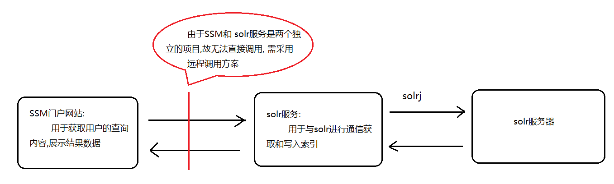

如何实现系统通信:

​       1、Web-service：效率不高基于soap协议。项目中不推荐使用。 (http + xml)

​       2、使用restful形式的服务：http+json。很多项目中应用。如果服务太多，服务之间调用关系混乱，需要治疗服务。

​       3、使用dubbo。使用rpc协议进行远程调用，直接使用socket通信。传输效率高，并且可以统计出系统之间的调用关系、调用次数。**分布式项目中经常采用此种方式**

## 8.dubbox框架

​	Dubbox 是一个分布式服务框架，其前身是阿里巴巴开源项目Dubbo ，被国内电商及互联网项目中使用，后期阿里巴巴停止了该项目的维护，当当网便在Dubbo基础上进行优化，并继续维护，为了与原有的Dubbo区分，故将其命名为**Dubbox**。 2016年阿里重新将dubbo进行了维护, 并在2017将dubbo贡献给apache, 目前已经成为apache的顶级的项目

​	Dubbox 致力于提供高性能和透明化的RPC远程服务调用方案

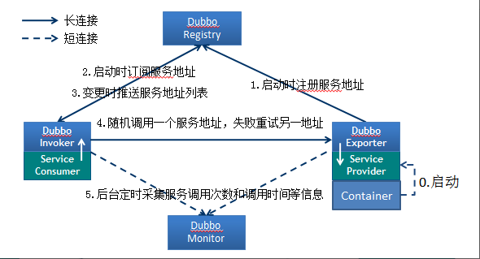

```
节点角色说明：
	Provider: 暴露服务的服务提供方。
	Consumer: 调用远程服务的服务消费方。
	Registry: 服务注册与发现的注册中心。
	Monitor: 统计服务的调用次调和调用时间的监控中心。
	Container: 服务运行容器。
调用关系说明：
	0. 服务容器负责启动，加载，运行服务提供者。
	1. 服务提供者在启动时，向注册中心注册自己提供的服务。
	2. 服务消费者在启动时，向注册中心订阅自己所需的服务。
	3. 注册中心返回服务提供者地址列表给消费者，如果有变更，注册中心将基于长连接推送变更数据给消费者。
	4. 服务消费者，从提供者地址列表中，基于软负载均衡算法，选一台提供者进行调用，如果调用失败，再选另一台调用。
	5. 服务消费者和提供者，在内存中累计调用次数和调用时间，定时每分钟发送一次统计数据到监控中心。
```

### 8.1 dubbox的基本使用

​	dubbox官方推荐使用zookeeper作为dubbox的注册中心, 负责服务地址的注册与查找,服务提供者和消费者只在启动时与注册中心交互，注册中心不转发请求，压力较小。

> 需注意, dubbox并没有在maven的中央仓库中存在, 需要手动将Dubbox的jar包安装到我的本地仓库中。
>
> 先将dubbo-2.8.4.jar包放到e:\setup, 然后输入命令

```
1) 查看maven的环境变量是否存在:  打开cmd  执行 mvn -version
2) 执行下列的命令即可
```

```
mvn install:install-file -Dfile=e:\setup\dubbo-2.8.4.jar -DgroupId=com.alibaba -DartifactId=dubbo -Dversion=2.8.4 -Dpackaging=jar
```

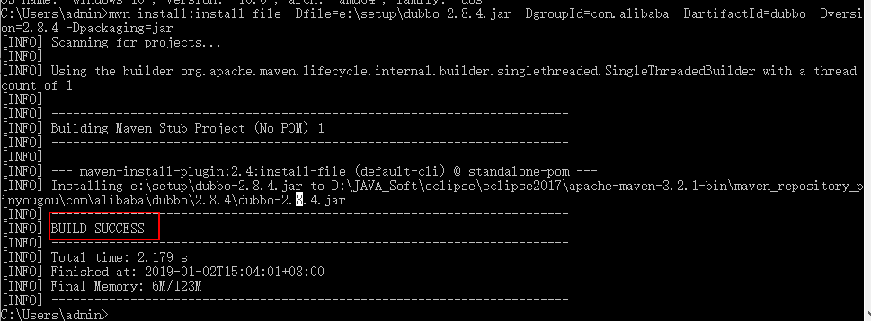


* 1) 创建一个父工程: gossip-dubboxDemo-parent
  * 在父工程中添加如下依赖

```xml
<!-- 集中定义依赖版本号 -->
    <properties>
        <junit.version>4.12</junit.version>
        <spring.version>4.2.4.RELEASE</spring.version>
        <servlet-api.version>2.5</servlet-api.version>
        <dubbo.version>2.8.4</dubbo.version>
        <zookeeper.version>3.4.7</zookeeper.version>
        <zkclient.version>0.1</zkclient.version>
        <mybatis.version>3.2.8</mybatis.version>
        <mybatis.spring.version>1.2.2</mybatis.spring.version>
        <mysql.version>5.1.32</mysql.version>
        <druid.version>1.0.9</druid.version>
        <freemarker.version>2.3.23</freemarker.version>
        <solrj.version>4.10.2</solrj.version>
        <javassist.version>3.11.0.GA</javassist.version>
    </properties>

    <dependencyManagement>
        <dependencies>
            <!-- spring 相关的依赖包 -->
            <dependency>
                <groupId>org.springframework</groupId>
                <artifactId>spring-context</artifactId>
                <version>${spring.version}</version>
            </dependency>
            <dependency>
                <groupId>org.springframework</groupId>
                <artifactId>spring-beans</artifactId>
                <version>${spring.version}</version>
            </dependency>

            <dependency>
                <groupId>org.springframework</groupId>
                <artifactId>spring-jdbc</artifactId>
                <version>${spring.version}</version>
            </dependency>
            <dependency>
                <groupId>org.springframework</groupId>
                <artifactId>spring-aspects</artifactId>
                <version>${spring.version}</version>
            </dependency>
            <dependency>
                <groupId>org.springframework</groupId>
                <artifactId>spring-jms</artifactId>
                <version>${spring.version}</version>
            </dependency>
            <dependency>
                <groupId>org.springframework</groupId>
                <artifactId>spring-context-support</artifactId>
                <version>${spring.version}</version>
            </dependency>
            <dependency>
                <groupId>org.springframework</groupId>
                <artifactId>spring-web</artifactId>
                <version>${spring.version}</version>
            </dependency>
            <!-- mybatis 相关的依赖包 -->
            <dependency>
                <groupId>org.mybatis</groupId>
                <artifactId>mybatis</artifactId>
                <version>${mybatis.version}</version>
            </dependency>
            <dependency>
                <groupId>org.mybatis</groupId>
                <artifactId>mybatis-spring</artifactId>
                <version>${mybatis.spring.version}</version>
            </dependency>
            <!-- springmvc的相关依赖包 -->
            <dependency>
                <groupId>org.springframework</groupId>
                <artifactId>spring-webmvc</artifactId>
                <version>${spring.version}</version>
            </dependency>

            <!-- 数据库的相关依赖包 -->
            <dependency>
                <groupId>mysql</groupId>
                <artifactId>mysql-connector-java</artifactId>
                <version>${mysql.version}</version>
            </dependency>
            <!-- 连接池 -->
            <dependency>
                <groupId>com.alibaba</groupId>
                <artifactId>druid</artifactId>
                <version>${druid.version}</version>
            </dependency>

            <!-- 日志相关的依赖包 -->
            <dependency>
                <groupId>org.slf4j</groupId>
                <artifactId>slf4j-log4j12</artifactId>
                <version>1.6.4</version>
            </dependency>
            <dependency>
                <groupId>log4j</groupId>
                <artifactId>log4j</artifactId>
                <version>1.2.17</version>
            </dependency>

            <!--json相关的依赖-->
            <dependency>
                <groupId>com.alibaba</groupId>
                <artifactId>fastjson</artifactId>
                <version>1.2.28</version>
            </dependency>


            <!--solr相关依赖-->
            <dependency>
                <groupId>org.apache.solr</groupId>
                <artifactId>solr-solrj</artifactId>
                <version>${solrj.version}</version>
            </dependency>


            <!--测试相关-->

            <dependency>
                <groupId>junit</groupId>
                <artifactId>junit</artifactId>
                <version>${junit.version}</version>
            </dependency>
            <dependency>
                <groupId>org.springframework</groupId>
                <artifactId>spring-test</artifactId>
                <version>${spring.version}</version>
            </dependency>


            <!--dubbox相关依赖-->
            <dependency>
                <groupId>com.alibaba</groupId>
                <artifactId>dubbo</artifactId>
                <version>${dubbo.version}</version>
            </dependency>
            <!--zookeeper相关依赖-->
            <dependency>
                <groupId>org.apache.zookeeper</groupId>
                <artifactId>zookeeper</artifactId>
                <version>${zookeeper.version}</version>
            </dependency>
            <dependency>
                <groupId>com.github.sgroschupf</groupId>
                <artifactId>zkclient</artifactId>
                <version>${zkclient.version}</version>
            </dependency>

            <dependency>
                <groupId>javassist</groupId>
                <artifactId>javassist</artifactId>
                <version>${javassist.version}</version>
            </dependency>
        </dependencies>

    </dependencyManagement>


    <build>
        <plugins>
            <plugin>
                <groupId>org.apache.maven.plugins</groupId>
                <artifactId>maven-compiler-plugin</artifactId>
                <version>3.1</version>
                <configuration>
                    <source>1.8</source>
                    <target>1.8</target>
                    <encoding>utf-8</encoding>
                </configuration>
            </plugin>

        </plugins>
    </build>
```

* 2) 创建服务提供者: dubboxdemo-service  (war工程)

  * 2.1) 添加如下内容依赖:

  ```xml
  <dependencies>
  		<!-- Spring -->
  		<dependency>
  			<groupId>org.springframework</groupId>
  			<artifactId>spring-context</artifactId>
  		</dependency>
  		<dependency>
  			<groupId>org.springframework</groupId>
  			<artifactId>spring-beans</artifactId>
  		</dependency>
  		<dependency>
  			<groupId>org.springframework</groupId>
  			<artifactId>spring-webmvc</artifactId>
  		</dependency>
  		<dependency>
  			<groupId>org.springframework</groupId>
  			<artifactId>spring-jdbc</artifactId>
  		</dependency>
  		<dependency>
  			<groupId>org.springframework</groupId>
  			<artifactId>spring-aspects</artifactId>
  		</dependency>
  		<dependency>
  			<groupId>org.springframework</groupId>
  			<artifactId>spring-jms</artifactId>
  		</dependency>
  		<dependency>
  			<groupId>org.springframework</groupId>
  			<artifactId>spring-context-support</artifactId>
  		</dependency>	
  		<!-- dubbo相关 -->
  		<dependency>
  			<groupId>com.alibaba</groupId>
  			<artifactId>dubbo</artifactId>			
  		</dependency>
  		<dependency>
  			<groupId>org.apache.zookeeper</groupId>
  			<artifactId>zookeeper</artifactId>
  		</dependency>
  		<dependency>
  			<groupId>com.github.sgroschupf</groupId>
  			<artifactId>zkclient</artifactId>
  		</dependency>		
  		<dependency>
  			<groupId>javassist</groupId>
  			<artifactId>javassist</artifactId>
  		</dependency>		
  	</dependencies>
     <build>  
  	  <plugins>
  	      <plugin>  
  	          <groupId>org.apache.maven.plugins</groupId>  
  	          <artifactId>maven-compiler-plugin</artifactId>  
  	          <version>2.3.2</version>  
  	          <configuration>  
  	              <source>1.8</source>  
  	              <target>1.8</target>  
  	          </configuration>  
  	      </plugin>  
  	      <plugin>
  				<groupId>org.apache.tomcat.maven</groupId>
  				<artifactId>tomcat7-maven-plugin</artifactId>
  				<configuration>
  					<!-- 指定端口 -->
  					<port>8081</port>
  					<!-- 请求路径 -->
  					<path>/</path>
  				</configuration>
  	  	  </plugin>
  	  </plugins>  
      </build>
  ```

  * 2.2) 在工程的webapps下创建WEB-INF文件夹，找到web.xml,添加如下内容

  ```xml
  <!-- 加载spring容器 -->
  	<context-param>
  		<param-name>contextConfigLocation</param-name>
  		<param-value>classpath:applicationContext*.xml</param-value>
  	</context-param>
  	<listener>		
          <listener-class>org.springframework.web.context.ContextLoaderListener</listener-class>
  	</listener>	
  ```

  * 2.3) 创建一个业务的接口
    * 创建包:cn.itcast.dubboxdemo.service,用于存放业务接口

  ```java
  package cn.itcast.dubboxdemo.service;
  /**
   * 业务接口
   */
  public interface UserService {	
  	public String getName();	
  }
  ```

  * 2.4) 创建业务实现类
    * 创建包cn.itcast.dubboxdemo.service.impl ，用于存放业务实现类。创建业务实现类：

  ```java
  package cn.itcast.dubboxdemo.service.impl;
  import com.alibaba.dubbo.config.annotation.Service;
  import cn.itcast.dubbodemo.service.UserService;
  //注意：Service注解与原来不同，需要引入com.alibaba包下的
  @Service
  public class UserServiceImpl implements UserService {
  	public String getName() {		
  		return "itcast";
  	}
  }
  ```

  * 2.5) 编写配置文件
    * 在resources下创建applicationContext-service.xml ,内容如下：

  ```xml
  <?xml version="1.0" encoding="UTF-8"?>
  <beans xmlns="http://www.springframework.org/schema/beans"
  	xmlns:xsi="http://www.w3.org/2001/XMLSchema-instance" xmlns:p="http://www.springframework.org/schema/p"
  	xmlns:context="http://www.springframework.org/schema/context"
  	xmlns:dubbo="http://code.alibabatech.com/schema/dubbo" xmlns:mvc="http://www.springframework.org/schema/mvc"
  	xsi:schemaLocation="http://www.springframework.org/schema/beans http://www.springframework.org/schema/beans/spring-beans.xsd
          http://www.springframework.org/schema/mvc http://www.springframework.org/schema/mvc/spring-mvc.xsd
          http://code.alibabatech.com/schema/dubbo http://code.alibabatech.com/schema/dubbo/dubbo.xsd
          http://www.springframework.org/schema/context http://www.springframework.org/schema/context/spring-context.xsd">
       
      <dubbo:application name="dubboxdemo-service"/>  
      <dubbo:registry protocol="zookeeper" address="192.168.72.141:2181,192.168.72.142:2181,192.168.72.143:2181"/>
      <!--注意：dubbo:annotation用于扫描@Service注解。-->
      <dubbo:annotation package="cn.itcast.dubboxdemo.service" /> 
  </beans>
  ```

  * 2.6) 测试运行

  ```
  tomcat7:run
  ```


* 3.服务消费者开发

  * 3.1) 创建Maven工程（WAR）dubboxdemo-web ，在pom.xml引入依赖 ，同“dubboxdemo-service”工程。区别就是把tomcat插件的运行端口改为8082 。
  * 3.2) 在webapps下WEB-INF 目录，找到web.xml,添加如下内容

  ```xml
  <!-- 解决post乱码 -->
  	<filter>
  		<filter-name>CharacterEncodingFilter</filter-name>		
          <filter-class>org.springframework.web.filter.CharacterEncodingFilter</filter-class>
  		<init-param>
  			<param-name>encoding</param-name>
  			<param-value>utf-8</param-value>
  		</init-param>
  		<init-param>  
              <param-name>forceEncoding</param-name>
              <param-value>true</param-value>  
          </init-param>  
  	</filter>
  	<filter-mapping>
  		<filter-name>CharacterEncodingFilter</filter-name>
  		<url-pattern>/*</url-pattern>
  	</filter-mapping>		
    <servlet>
    	<servlet-name>springmvc</servlet-name>  	
  	<servlet-class>org.springframework.web.servlet.DispatcherServlet</servlet-class>
    	<!-- 指定加载的配置文件 ，通过参数contextConfigLocation加载-->
    	<init-param>
    		<param-name>contextConfigLocation</param-name>
    		<param-value>classpath:applicationContext-web.xml</param-value>
    	</init-param>
    </servlet>  
    <servlet-mapping>
    	<servlet-name>springmvc</servlet-name>
    	<url-pattern>*.do</url-pattern>
    </servlet-mapping>
  ```

  * 3.3) 拷贝业务接口
    * 将“dubboxdemo-service”工程的cn.itcast.dubboxdemo.service 包以及下面的接口拷贝至此工程。
  * 3.4) 编写Controller : 包名:  cn.itcast.dubboxdemo.controller

  ```java
  package cn.itcast.dubboxdemo.controller;
  import org.springframework.beans.factory.annotation.Autowired;
  import org.springframework.stereotype.Controller;
  import org.springframework.web.bind.annotation.RequestMapping;
  import org.springframework.web.bind.annotation.ResponseBody;
  import cn.itcast.dubbodemo.service.UserService;
  @Controller
  @RequestMapping("/user")
  public class UserController {
  	@Reference
  	private UserService userService;	
  	@RequestMapping("/showName")
  	@ResponseBody
  	public String showName(){
  		return userService.getName();
  	}		
  }
  ```

  * 3.5) 编写spring配置文件
    * 在src/main/resources下创建applicationContext-web.xml

  ```xml
  <?xml version="1.0" encoding="UTF-8"?>
  <beans xmlns="http://www.springframework.org/schema/beans"
  	xmlns:xsi="http://www.w3.org/2001/XMLSchema-instance" xmlns:p="http://www.springframework.org/schema/p"
  	xmlns:context="http://www.springframework.org/schema/context"
  	xmlns:dubbo="http://code.alibabatech.com/schema/dubbo" xmlns:mvc="http://www.springframework.org/schema/mvc"
  	xsi:schemaLocation="http://www.springframework.org/schema/beans http://www.springframework.org/schema/beans/spring-beans.xsd
          http://www.springframework.org/schema/mvc http://www.springframework.org/schema/mvc/spring-mvc.xsd
          http://code.alibabatech.com/schema/dubbo http://code.alibabatech.com/schema/dubbo/dubbo.xsd
          http://www.springframework.org/schema/context http://www.springframework.org/schema/context/spring-context.xsd">
  
  	<mvc:annotation-driven >
  		<mvc:message-converters register-defaults="false">
  			<bean class="org.springframework.http.converter.StringHttpMessageConverter">  
  				<constructor-arg value="UTF-8" />
  			</bean>  
  		</mvc:message-converters>	
  	</mvc:annotation-driven>
  	<!-- 引用dubbo 服务 -->
  	<dubbo:application name="dubboxdemo-web" />
  	<dubbo:registry protocol="zookeeper" address="192.168.72.141:2181,192.168.72.142:2181,192.168.72.143:2181"/>
       <dubbo:annotation package="cn.itcast.dubboxdemo.controller" />
  </beans>
  ```

  * 3.6) 测试运行

  ```
  tomcat7:run
  
  在浏览器输入http://localhost:8082/user/showName.do，查看浏览器输出结果
  ```

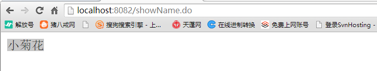

使用步骤:

1) 导包:  spring +dubbox+zookeeper

2) 添加spring的配置文件:

```
    <dubbo:application name="dubboxdemo-web" />
    <dubbo:registry protocol="zookeeper" address="192.168.72.141:2181,192.168.72.142:2181,192.168.72.143:2181"/>
    <!--只需要更改扫描包的位置-->
    <dubbo:annotation package="cn.itcast.dubboxdemo.controller" />
```

3) 在服务端添加 @service注解, 在web端添加@Reference


总结: 

* solrCloud :   
  * 1) 为什么要使用solrCloud: 搜索高并发 , 索引量大
  * 2) 如果部署solrCloud需要先部署一个zookeeper
    * zookeeper: 是一个集群的管理工具, 在solrCloud中主要用来管理配置文件, 集群状态, solrCloud主节点选举
  * 3) 能够将zookeeper集群 和 solrCloud的集群搭建成功
  * 4) 使用solrCloud的管理命令创建一个新的索引库(符合结构规定)
  * 5) 使用solrj完成对solrCloud的操作
* dubbox:
  * 基本使用
  * 理解: 为什么要使用dubbox